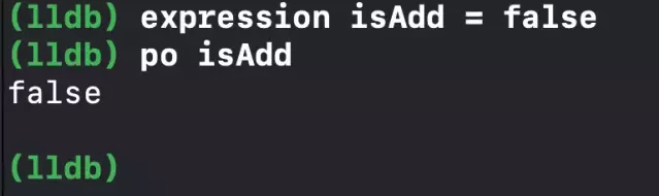
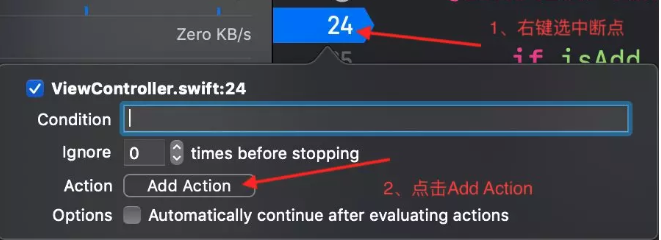
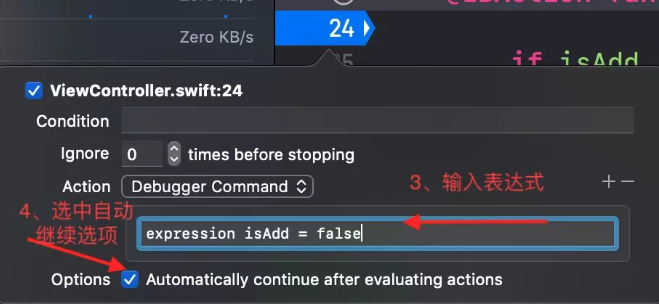

# 高效的使用LLDB调试手段

##  expression 的使用

在我们日常开发中，经常会碰到一些某些特定情况下出现 Bug 的问题，比如下面这段代码：

```objective-c
// Bug: 减操作错误，应该减一
if isAdd {
    count = count + 1
} else {
    count = count - 2
}
countLabel.text = "(count)"
```

代码说明：

```
isAdd 是一个布尔值，我们通过这个布尔值来对count进行相应操作。
正常的需求是：如果isAdd是true我们则对count进行加一操作；
如果isAdd是false我们则对count进行减一的操作。
```

现在根据上下文isAdd的值为true，假如我们要测试为false的情况，我们可能会在项目中手动将isAdd设为false在重新运行项目验证修改的结果。那么我们如何在不用重新运行项目的情况下修改isAdd的值呢？答案就是 expression了。

expression 有两种使用方式：

- 在 LLDB 中输入：每次都要输入
- 在断点中配置：只需输入一次

### 在 LLDB 中的使用



### 在断点中的配置

下面是具体操作流程：

- 在 i<u>f  isAdd {</u> 这行代码打一个断
- 右键断点选择 `edit Breakpoint`
- 点击弹出框的 Action 按钮，在下方的文本框输入<u>expression isAdd = false</u>
- 选中 optional 选项





再进行相关操作，就看见 if 语句执行的是 else 的分支了，同理你也可以将count = count - 1设置为表达式来验证结果。

Plus:编辑过的断点会在箭头内部添加一个白色三角形，具体可见上方的两个图的区别。这样可以使我们更方便的找到已经编辑过的断点。

### **thread jump 的使用**

当我们想跳过一行代码的时候我们可以使用这个命令，当我们使用的时候，Xcode 会弹出一个警告，告诉我们这种做法很危险。所以，我们使用的时候要确保不会出现问题再使用。

具体使用与上面的步骤类似，唯一的不同就是把上面的命令替换为thread jump --by 1。该命令的1就是跳过1行的意思，我们可以根据具体需求修改此值。

### 修改UI

下面介绍一种非常实用的命令，那就是使用断点来调试 UI 问题。在日常开发中，我们会经常微调一些 UI 样式，每次修改再重新编译运行是非常浪费时间的，我们可以通过 LLDB 来实现改完不运行即可看见效果。

比如我们想要修改self.view的某个子控件的位置，我们可以使用下面的命令来打印出self.view的所有子控件的详细信息

```objective-c
//格式：expression -l objc -O -- <expr>
// - 打印self.view 的子视图
expression -l objc -O -- [`self.view` recursiveDescription]
  
```

通过上面的命令我们可以拿到需要修改控件的内存地址，然后再用下面的命令来修改子控件的 frame ：

```
//格式：unsafeBitCast(point, to: type)
//第一个参数为子控件的内存地址，第二个参数为子控件的类型。

// - 将一个UIButton的实例的x赋值为100
expression unsafeBitCast(0x7fa94cb015c0, to: UIButton.self).frame.origin.x = 100
```


将子控件的内存地址修改之后，我们可以通过以下命令来刷新暂存区，看见实际的效果，而不是通过重新运行。

```
//刷新暂缓区 
expression CATransaction.flush()
```

### 设置别名

上面的命令很长，我们每次都这么输入很麻烦，我们可以也可以设置别名来使用。

```
//设置别名
commend alias 别名 原命令
//这样就可以使用 flush 来代替 expression CATransaction.flush()
command alias flush expression -l objc -- (void)[CATransaction flush]

```

参考:

- Advanced Debugging with Xcode and LLDB

[https://developer.apple.com/videos/play/wwdc2018/412/]()

