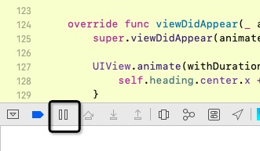
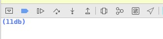
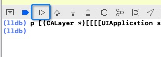

# 如何实现慢速调试动画

## 平时碰到的问题

平常的开发过程中，UI 设计出需要多个动画串联起来，挨个动画的效果。可能我们需要将动画时长加长几倍，作为开发才能看清楚动效是否是我们想要的。

## 之前的解决办法

通过挨个设置每个动画的时长，可以实现慢速调试的效果

缺点：

1. 可能需要设置很多动画时长的参数，改动比较繁琐
2. 需要重新编译运行

## 新方法

好处：

1. 运行时，随时可以调整动画速度，不需要重新编译
2. 不需要逐个设置动画时长，是全局性的放慢速度

### 通用方法

该方法在真机和模拟器中可以通用。在调试模式下，运行 APP 之后，

点击如下图的暂停按钮：



随后在 lldb 中输入以下代码，即可调整动画整体速度。



```objective-c
// setSpeed 参数 指的就是速度倍数
p [(CALayer *)[[[[UIApplication sharedApplication] windows] objectAtIndex:0] layer] setSpeed:.1f]
```

等待 1~3 秒，待执行完毕，点击下图按钮，恢复程序运行：



接下来执行动画，就能看到动画速度变慢啦。

### 模拟器特有方法

打开模拟器后，在菜单栏选择 Debug - Slow Animations 即可。


选择完毕后，可以实现整个动画过程的慢速调试。


