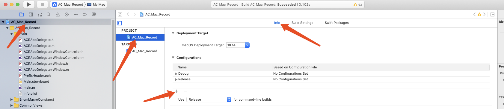
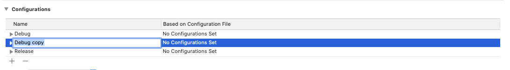
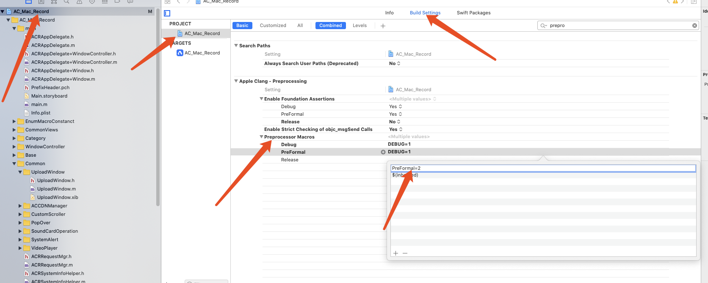
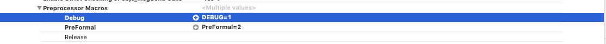
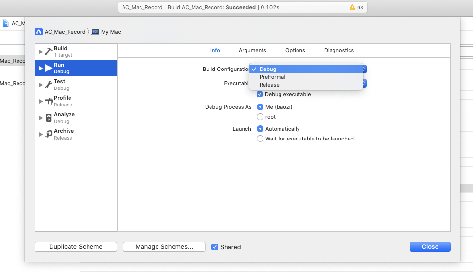

#Xcode中如何自定义环境变量?

@(PandaABC)

#####Xcode默认下有两种环境，分别是debug和release, 但是有些情况下我们需要更多的控制变量来控制代码的走向 或者 控制打包的需求, 如何自定义环境变量呢? 具体步骤如下:
- 打开工程->选择我们的项目->选择当前project->选择info->在configuration这一栏, 点击+号
界面如下图, 然后自己取一个想要的环境变量名称.


- 下一步, 修改预处理器的宏值:

修改完之后 如下图:

这样子环境变量就添加好了. 那么如何使用呢?
我们可以使用预处理指令 `#if` `#elseif` `#endif` 来判断当前所处的环境. 
比如: 河马项目中的需求, 在DEBUG环境下打开哆啦A梦, TEST环境下 如果本地开关打卡, 则打开哆啦A梦, 否则不做处理. 代码如下:
```
 #if DEBUG
        initDoraemon()
 #elseif TEST
        if Defaults[.isOpenDorea] {
            initDoraemon()
        }
 #endif
```
然后 点击快捷键`command+shift+<`打开控制面板  如下图:

点击选择所对应的环境, 可进行调试.