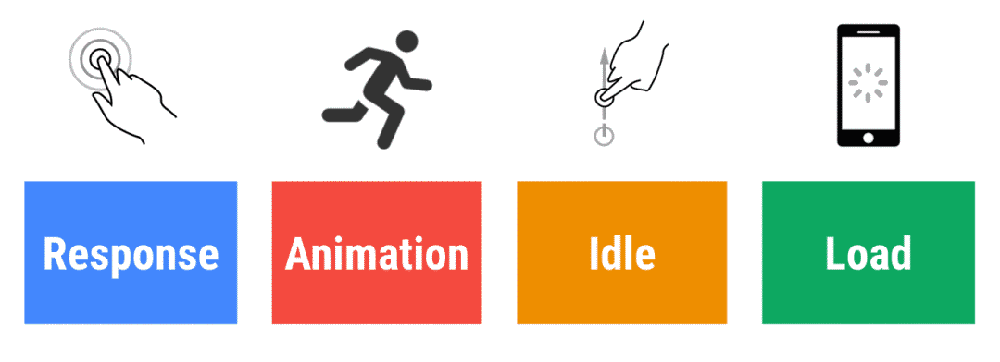
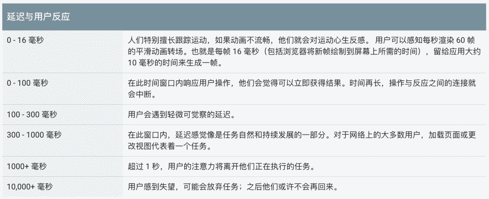
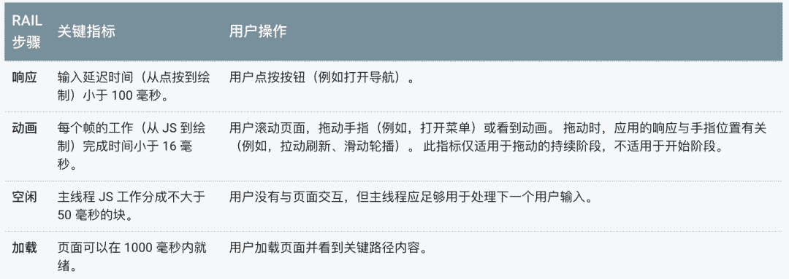
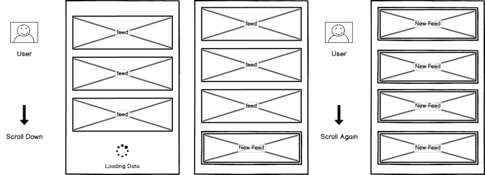
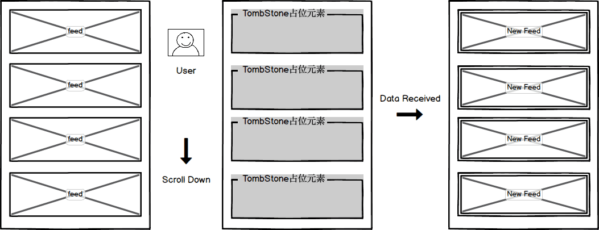
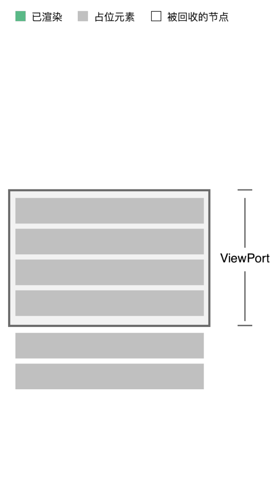
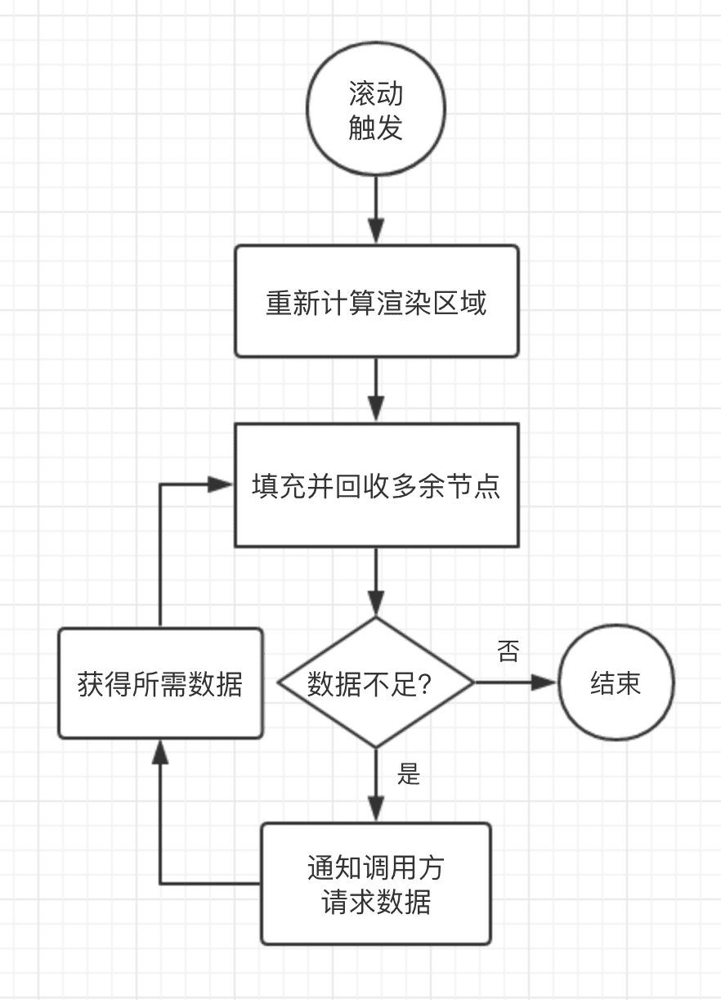
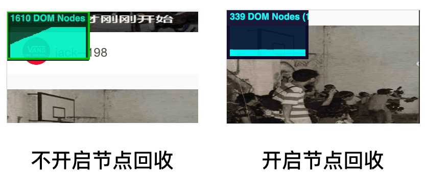

# 如何打造无卡顿的滚动列表

在技术变化与发展如此之快的今天，web用户对页面的访问速度与响应度提出了越来越高的要求。

其中的“响应度”不仅仅是实现层面的问题，更是个设计问题，仅靠性能优化与更快的硬件是难以解决的。

本文以常见的「无尽滚动列表」场景为案例，阐述如何从交互的角度看待和提升用户体验的思路，提升页面的「响应度」。

## 用户体验就是生产力

> 感知的响应度可能看起来不如有效性重要，但实际上恰好相反。
>
> 研究人员在过去50年里一致发现，一个交互系统的响应度，即能否跟上用户、及时告知当前状态，而不让他们无故等待，是决定用户满意度的最重要的因素。 
>
> From: Designing with the Mind in Mind - Jeff Johnson 

Google RAIL性能模型的目标，就是使用户满意，而不是让页面能运行的很快。

让用户花在网站上的大多数时间**不是等待加载，而是在使用时等待响应**。

### 大脑需要多少时间去“感觉“与”认知”？

事件发生需要时间，而我们感知物体与事件也需要时间。

人类的大脑和神经系统并不是一个单一器官，而是由许多基于神经元的器官集合组成，提供了大量不同的感觉、调控、认知等功能，这些功能的运行速度是不同的，有些非常迅速，而另一些可能需要花上数小时的时间。

我们的认知与感觉功能，其实是在一系列的时间常量中完成的，并且我们做一些无意识的操作，往往比那些需要控制和监管的反应快很多。

例如我们的听觉系统能察觉出声音到达耳朵1ms内的差异，从而通过左右耳的时间差，判断声源的方向。

同样，人们对延迟和停顿的感知能力也有一定的反应时间。

### 列表滚动时“停顿感”的产生

- 用户滑动
- 等待数据加载
- 渲染新数据
- 用户继续滑动，查看新渲染的内容

“滚动事件触发 -> 异步获取数据 -> 渲染” 这样的机制，页面响应用户操作，并渲染新内容可能需要花费大于500ms的时间。

尽管提供了spinner等友好的反馈提示，但用户切实的感受到了“等待加载”这一过程，而且需要再次滚动，才能浏览新渲染的内容。

## 如何提高响应度

### 1. 预加载

预加载是常用的优化手段之一，设置一定的阈值，在用户滚动到页面底部前获取数据，加载下一页的数据并渲染。

预加载能有效的提升体验，但是在弱网环境或用户快速滚动时，底部的loading依然会经常性的触发。

而一味的提高提前加载的阈值，肯定不是个好办法，首先是网络状况等情况随时可能改变，导致边界难以确定，其次是必定会产生大量冗余的数据请求。

### 2. 无阻塞的滚动

这是一种比较理想的列表运行方式，滚动时永远不打断用户操作，数据不足时根据滚动位置按需加载，先插入占位元素，等到数据获取时再渲染新的元素。

## mui-infinite-list 工作原理

列表组件只关心和渲染限定范围（视窗可见区域+前后预Buffer数量）内的元素。

每当滚动触发导致元素移出视窗，组件会计算并填充渲染范围内变化的部分，并回收多余的DOM节点。

如果渲染范围内的元素还未取到所需的数据，则会先渲染占位元素，同时将缺失的数据条数通知给调用方，在异步数据返回后渲染并替换占位元素。

## Feature

### DOM节点回收

测试Case中渲染了200行的数据，并滑动到了列表底部。

未开启节点回收时，最后的节点数为1610，开启之后减少到了339。

### 按需加载数据

平时翻页获取数据的场景，我们往往在前端设置固定的pageSize，通知后端返回固定长度的data，用户飞快滚动时，过小的pageSize会导致短时间内的请求数量激增，设置的过大时，又经常造成一定程度的浪费。

本组件在滑动触发时，能根据滚动的实际情况返回缺少数据的列表项数量，调用方可以弹性的设置pageSize。

### 普通流

会场促销等场景中，通常出现版头+坑位+列表组合使用的情况，单一的列表很少出现。

组件使用了原生的body滚动，可以与其他模块结合使用。

## 结尾

交互准则与理论能够帮助我们推演和解释不同方案之间的差异，减少试错成本。但最终的价值判断，仍然要依靠abTest等手段和数据结果。

现在各种终端设备的性能正在飞速提升，但是程序也在交给设备越来越重的负荷。响应度现在仍然是问题，而且以后也不会消失，相信时刻关注它，一定会给我们的业务带来切实的价值提升。

> [响应至上：打造无卡顿的滚动列表](https://mp.weixin.qq.com/s/EL5QTR2x2HQb-T6jcYKDlA)