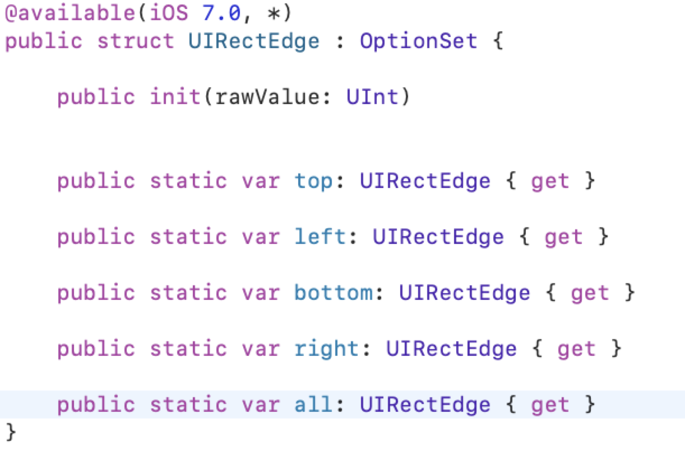

## 什么是 edgesForExtendedLayout 有什么作用?

在这里需要提及到三个属性

- `edgesForExtendedLayout` 

-  `automaticallyAdjustsScrollViewInsets`   *iOS6 引入 iOS11废除*

- `extendedLayoutIncludesOpaqueBars`

  这三个属性都属于iOS7之后为`UIViewController `添加的属性. iOS7之前 `UIViewController.view`如果镶嵌在`NavigationController`或者是`TabbarController`中的话, 是不会延伸到`navagationBar` 或者` tabbar` 上面的. iOS7之后所添加的三个属性, 是为了更加自由的控制view controller 如何布局 views.

  #### edgesForExtendedLayout

  通过设置此属性, 可以指定view的边界(上下左右)延伸到整个屏幕.

edgesForExtendedLayout属性是个枚举值, 默认是`all` 

如果设置成 `edgesForExtendedLayout = UIRectEdge.bottom` ; 那么就会`self.view.frame`是从`navigationBar`下面开始计算一直到屏幕底部.

​	如果设置成 `edgesForExtendedLayout = UIRectEdge.init()`; 那么就会`self.view.frame`是从`navigationBar`下面开始计算 一直到屏幕tabbar上部.

​	如果设置成` edgesForExtendedLayout = UIRectEdge.top`; 那么就会`self.view.frame` 是从`navigationBar`上面计算, 一直到屏幕`tabbar`上部. 

### automaticallyAdjustsScrollViewInsets

`UINavigationBar与UITabBar`默认都是半透明模糊效果，在这种情况下系统会对视图控制器的UI布局进行优化：当视图控制器里面【第一个】被添加进去的视图是`UIScrollView`或其子类时，系统会自动调整其内边距属性`contentInset`，以保证滑动视图里的内容不被`UINavigationBar`与`UITabBar`遮挡。

> automaticallyAdjustsScrollViewInsets的设置只对滚动视图有效，对普通的view无效；对普通view而言，view怎么布局, 就会怎么显示, 布局的原点跟navagationBar和tabbar的是否半透明属性相关。滚动视图的contentInset是否偏移, 跟automaticallyAdjustsScrollViewInsets的设置有关. iOS11之后 废弃了此属性, 增加了滚动视图的contentInsetAdjustmentBehavior 属性来控制contentInset的偏移.

### extendedLayoutIncludesOpaqueBars

**extendedLayoutIncludesOpaqueBars**是前面两个属性的补充。默认值是false. 

苹果的状态栏(status bar)默认是透明的。如果状态栏不透明，这个视图就不会扩展到不透明的状态栏底部，除非将其值设置为YES, 所以如果状态栏不透明，即使你设置`edgesForExtendedLayout` 为 `all`，`extendedLayoutIncludesOpaqueBars`为NO(默认如此)，view不会延伸到状态栏底部的。

