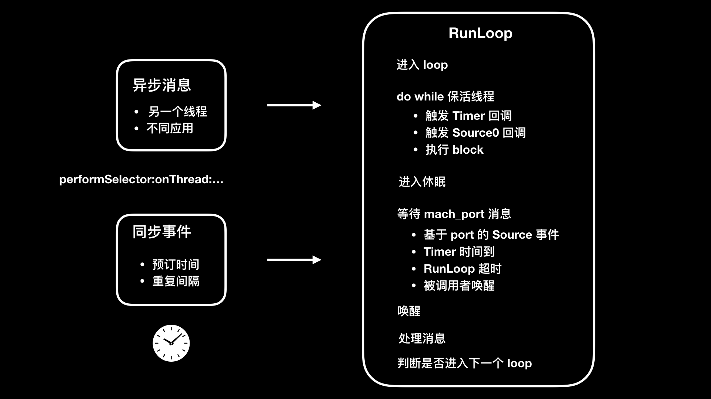

[Toc]
# 如何利用 RunLoop 原理去监控卡顿？

卡顿问题，就是在主线程上无法响应用户交互的问题。如果一个 App 时不时地就给你卡一下，有时还长时间无响应，这时你还愿意继续用它吗？所以说，卡顿问题对 App 的伤害是巨大的，也是我们必须要重点解决的一个问题。

现在，我们先来看一下导致卡顿问题的几种原因：
* 复杂 UI 、图文混排的绘制量过大；
* 在主线程上做网络同步请求；
* 在主线程做大量的 IO 操作；
* 运算量过大，CPU 持续高占用；死锁和主子线程抢锁。

那么，我们如何监控到什么时候会出现卡顿呢？

## RunLoop原理
对于 iOS 开发来说，监控卡顿就是要去找到主线程上都做了哪些事儿。我们都知道，线程的消息事件是依赖于 NSRunLoop 的，所以从 NSRunLoop 入手，就可以知道主线程上都调用了哪些方法。我们通过监听 NSRunLoop 的状态，就能够发现调用方法是否执行时间过长，从而判断出是否会出现卡顿。

所以，我推荐的监控卡顿的方案是：通过监控 RunLoop 的状态来判断是否会出现卡顿。

RunLoop 是 iOS 开发中的一个基础概念，为了帮助你理解并用好这个对象，接下来我会先和你介绍一下它可以做哪些事儿，以及它为什么可以做成这些事儿。

RunLoop 这个对象，在 iOS 里由 CFRunLoop 实现。简单来说，RunLoop 是用来监听输入源，进行调度处理的。这里的输入源可以是输入设备、网络、周期性或者延迟时间、异步回调。RunLoop 会接收两种类型的输入源：一种是来自另一个线程或者来自不同应用的异步消息；另一种是来自预订时间或者重复间隔的同步事件。

RunLoop 的目的是，当有事件要去处理时保持线程忙，当没有事件要处理时让线程进入休眠。所以，了解 RunLoop 原理不光能够运用到监控卡顿上，还可以提高用户的交互体验。通过将那些繁重而不紧急会大量占用 CPU 的任务（比如图片加载），放到空闲的 RunLoop 模式里执行，就可以避开在 UITrackingRunLoopMode 这个 RunLoop 模式时是执行。UITrackingRunLoopMode 是用户进行滚动操作时会切换到的 RunLoop 模式，避免在这个 RunLoop 模式执行繁重的 CPU 任务，就能避免影响用户交互操作上体验。

接下来，我就通过 CFRunLoop 的源码来跟你分享下 RunLoop 的原理吧。

## 第一步

通知 observers：RunLoop 要开始进入 loop 了。紧接着就进入 loop。代码如下：

```swift
//通知 observers
if (currentMode->_observerMask & kCFRunLoopEntry ) 
    __CFRunLoopDoObservers(runloop, currentMode, kCFRunLoopEntry);
//进入 loop
result = __CFRunLoopRun(rl, currentMode, seconds, returnAfterSourceHandled, previousMode);
```

## 第二步

开启一个 do while 来保活线程。通知 Observers：RunLoop 会触发 Timer 回调、Source0 回调，接着执行加入的 block。代码如下：

```swift
// 通知 Observers RunLoop 会触发 Timer 回调
if (currentMode->_observerMask & kCFRunLoopBeforeTimers)
    __CFRunLoopDoObservers(runloop, currentMode, kCFRunLoopBeforeTimers);
// 通知 Observers RunLoop 会触发 Source0 回调
if (currentMode->_observerMask & kCFRunLoopBeforeSources)
    __CFRunLoopDoObservers(runloop, currentMode, kCFRunLoopBeforeSources);
// 执行 block
__CFRunLoopDoBlocks(runloop, currentMode);
```

接下来，触发 Source0 回调，如果有 Source1 是 ready 状态的话，就会跳转到 handle_msg 去处理消息。代码如下：

```swift
if (MACH_PORT_NULL != dispatchPort ) {
    Boolean hasMsg = __CFRunLoopServiceMachPort(dispatchPort, &msg)
    if (hasMsg) goto handle_msg;
}
```

## 第三步

回调触发后，通知 Observers：RunLoop 的线程将进入休眠（sleep）状态。代码如下：

```swift
Boolean poll = sourceHandledThisLoop || (0ULL == timeout_context->termTSR);
if (!poll && (currentMode->_observerMask & kCFRunLoopBeforeWaiting)) {
    __CFRunLoopDoObservers(runloop, currentMode, kCFRunLoopBeforeWaiting);
}
```

## 第四步

进入休眠后，会等待 mach_port 的消息，以再次唤醒。只有在下面四个事件出现时才会被再次唤醒：

* 基于 port 的 Source 事件；
* Timer 时间到；
* RunLoop 超时；
* 被调用者唤醒。

等待唤醒的代码如下：

```swift
do { __CFRunLoopServiceMachPort(waitSet, &msg, sizeof(msg_buffer), &livePort) { 
    // 基于 port 的 Source 事件、调用者唤醒 
    if (modeQueuePort != MACH_PORT_NULL && livePort == modeQueuePort) { 
        break; 
    } 
    // Timer 时间到、RunLoop 超时 
    if (currentMode->_timerFired) { 
        break; 
    }
} while (1);
```

## 第五步

唤醒时通知 Observer：RunLoop 的线程刚刚被唤醒了。代码如下：
```swift
if (!poll && (currentMode->_observerMask & kCFRunLoopAfterWaiting))
    __CFRunLoopDoObservers(runloop, currentMode, kCFRunLoopAfterWaiting);
```

## 第六步

RunLoop 被唤醒后就要开始处理消息了：

* 如果是 Timer 时间到的话，就触发 Timer 的回调；
* 如果是 dispatch 的话，就执行 block；
* 如果是 source1 事件的话，就处理这个事件。

消息执行完后，就执行加到 loop 里的 block。代码如下：

```swift
handle_msg:
// 如果 Timer 时间到，就触发 Timer 回调
if (msg-is-timer) {
    __CFRunLoopDoTimers(runloop, currentMode, mach_absolute_time())
} 
// 如果 dispatch 就执行 block
else if (msg_is_dispatch) {
    __CFRUNLOOP_IS_SERVICING_THE_MAIN_DISPATCH_QUEUE__(msg);
} 

// Source1 事件的话，就处理这个事件
else {
    CFRunLoopSourceRef source1 = __CFRunLoopModeFindSourceForMachPort(runloop, currentMode, livePort);
    sourceHandledThisLoop = __CFRunLoopDoSource1(runloop, currentMode, source1, msg);
    if (sourceHandledThisLoop) {
        mach_msg(reply, MACH_SEND_MSG, reply);
    }
}
```

## 第七步

根据当前 RunLoop 的状态来判断是否需要走下一个 loop。当被外部强制停止或 loop 超时时，就不继续下一个 loop 了，否则继续走下一个 loop 。代码如下：

```swift
if (sourceHandledThisLoop && stopAfterHandle) {
     // 事件已处理完
    retVal = kCFRunLoopRunHandledSource;
} else if (timeout) {
    // 超时
    retVal = kCFRunLoopRunTimedOut;
} else if (__CFRunLoopIsStopped(runloop)) {
    // 外部调用者强制停止
    retVal = kCFRunLoopRunStopped;
} else if (__CFRunLoopModeIsEmpty(runloop, currentMode)) {
    // mode 为空，RunLoop 结束
    retVal = kCFRunLoopRunFinished;
}
```

整个 RunLoop 过程，我们可以总结为如下所示的一张图片。



## loop 的六个状态

通过对 RunLoop 原理的分析，我们可以看出在整个过程中，loop 的状态包括 6 个，其代码定义如下：

```swift
typedef CF_OPTIONS(CFOptionFlags, CFRunLoopActivity) {
    kCFRunLoopEntry , // 进入 loop
    kCFRunLoopBeforeTimers , // 触发 Timer 回调
    kCFRunLoopBeforeSources , // 触发 Source0 回调
    kCFRunLoopBeforeWaiting , // 等待 mach_port 消息
    kCFRunLoopAfterWaiting ), // 接收 mach_port 消息
    kCFRunLoopExit , // 退出 loop
    kCFRunLoopAllActivities  // loop 所有状态改变
}
```

如果 RunLoop 的线程，进入睡眠前方法的执行时间过长而导致无法进入睡眠，或者线程唤醒后接收消息时间过长而无法进入下一步的话，就可以认为是线程受阻了。如果这个线程是主线程的话，表现出来的就是出现了卡顿。

所以，如果我们要利用 RunLoop 原理来监控卡顿的话，就是要关注这两个阶段。RunLoop 在进入睡眠之前和唤醒后的两个 loop 状态定义的值，分别是 kCFRunLoopBeforeSources 和 kCFRunLoopAfterWaiting ，也就是要触发 Source0 回调和接收 mach_port 消息两个状态。

## 如何检查卡顿？

要想监听 RunLoop，你就首先需要创建一个 CFRunLoopObserverContext 观察者，代码如下：

```swift
CFRunLoopObserverContext context = {0,(__bridge void*)self,NULL,NULL};
runLoopObserver = CFRunLoopObserverCreate(kCFAllocatorDefault,kCFRunLoopAllActivities,YES,0,&runLoopObserverCallBack,&context);
```

将创建好的观察者 runLoopObserver 添加到主线程 RunLoop 的 common 模式下观察。然后，创建一个持续的子线程专门用来监控主线程的 RunLoop 状态。

一旦发现进入睡眠前的 kCFRunLoopBeforeSources 状态，或者唤醒后的状态 kCFRunLoopAfterWaiting，在设置的时间阈值内一直没有变化，即可判定为卡顿。接下来，我们就可以 dump 出堆栈的信息，从而进一步分析出具体是哪个方法的执行时间过长。

开启一个子线程监控的代码如下：

```swift
//创建子线程监控
dispatch_async(dispatch_get_global_queue(0, 0), ^{
    //子线程开启一个持续的 loop 用来进行监控
    while (YES) {
        long semaphoreWait = dispatch_semaphore_wait(dispatchSemaphore, dispatch_time(DISPATCH_TIME_NOW, 3 * NSEC_PER_SEC));
        if (semaphoreWait != 0) {
            if (!runLoopObserver) {
                timeoutCount = 0;
                dispatchSemaphore = 0;
                runLoopActivity = 0;
                return;
            }
            //BeforeSources 和 AfterWaiting 这两个状态能够检测到是否卡顿
            if (runLoopActivity == kCFRunLoopBeforeSources || runLoopActivity == kCFRunLoopAfterWaiting) {
                //将堆栈信息上报服务器的代码放到这里
            } //end activity
        }// end semaphore wait
        timeoutCount = 0;
    }// end while
});
```

代码中的 NSEC_PER_SEC，代表的是触发卡顿的时间阈值，单位是秒。可以看到，我们把这个阈值设置成了 3 秒。那么，这个 3 秒的阈值是从何而来呢？这样设置合理吗？

其实，触发卡顿的时间阈值，我们可以根据 WatchDog 机制来设置。WatchDog 在不同状态下设置的不同时间，如下所示：

* 启动（Launch）：20s；
* 恢复（Resume）：10s；
* 挂起（Suspend）：10s；
* 退出（Quit）：6s；
* 后台（Background）：3min（在 iOS 7 之前，每次申请 10min； 之后改为每次申请 3min，可连续申请，最多申请到 10min）。

通过 WatchDog 设置的时间，我认为可以把启动的阈值设置为 10 秒，其他状态则都默认设置为 3 秒。总的原则就是，要小于 WatchDog 的限制时间。当然了，这个阈值也不用小得太多，原则就是要优先解决用户感知最明显的体验问题。

## 如何获取卡顿的方法堆栈信息？

子线程监控发现卡顿后，还需要记录当前出现卡顿的方法堆栈信息，并适时推送到服务端供开发者分析，从而解决卡顿问题。那么，在这个过程中，如何获取卡顿的方法堆栈信息呢？

**获取堆栈信息的一种方法是直接调用系统函数**。这种方法的优点在于，性能消耗小。但是，它只能够获取简单的信息，也没有办法配合 dSYM 来获取具体是哪行代码出了问题，而且能够获取的信息类型也有限。这种方法，因为性能比较好，所以适用于观察大盘统计卡顿情况，而不是想要找到卡顿原因的场景。

直接调用系统函数方法的主要思路是：用 signal 进行错误信息的获取。具体代码如下：

```swift
static int s_fatal_signals[] = {
    SIGABRT,
    SIGBUS,
    SIGFPE,
    SIGILL,
    SIGSEGV,
    SIGTRAP,
    SIGTERM,
    SIGKILL,
};

static int s_fatal_signal_num = sizeof(s_fatal_signals) / sizeof(s_fatal_signals[0]);

void UncaughtExceptionHandler(NSException *exception) {
    NSArray *exceptionArray = [exception callStackSymbols]; //得到当前调用栈信息
    NSString *exceptionReason = [exception reason];       //非常重要，就是崩溃的原因
    NSString *exceptionName = [exception name];           //异常类型
}

void SignalHandler(int code)
{
    NSLog(@"signal handler = %d",code);
}

void InitCrashReport()
{
    //系统错误信号捕获
    for (int i = 0; i < s_fatal_signal_num; ++i) {
        signal(s_fatal_signals[i], SignalHandler);
    }
    
    //oc未捕获异常的捕获
    NSSetUncaughtExceptionHandler(&UncaughtExceptionHandler);
}

int main(int argc, char * argv[]) {
    @autoreleasepool {
        InitCrashReport();
        return UIApplicationMain(argc, argv, nil, NSStringFromClass([AppDelegate class]));
```

**另一种方法是，直接用 [PLCrashReporter](https://opensource.plausible.coop/src/projects/PLCR/repos/plcrashreporter/browse) 这个开源的第三方库来获取堆栈信息**。这种方法的特点是，能够定位到问题代码的具体位置，而且性能消耗也不大。所以，也是我推荐的获取堆栈信息的方法。

具体如何使用 PLCrashReporter 来获取堆栈信息，代码如下所示：

```objective-C
// 获取数据
NSData *lagData = [[[PLCrashReporter alloc]
                                          initWithConfiguration:[[PLCrashReporterConfig alloc] initWithSignalHandlerType:PLCrashReporterSignalHandlerTypeBSD symbolicationStrategy:PLCrashReporterSymbolicationStrategyAll]] generateLiveReport];
// 转换成 PLCrashReport 对象
PLCrashReport *lagReport = [[PLCrashReport alloc] initWithData:lagData error:NULL];
// 进行字符串格式化处理
NSString *lagReportString = [PLCrashReportTextFormatter stringValueForCrashReport:lagReport withTextFormat:PLCrashReportTextFormatiOS];
//将字符串上传服务器
NSLog(@"lag happen, detail below: \n %@",lagReportString);
```

搜集到卡顿的方法堆栈信息以后，就是由开发者来分析并解决卡顿问题了。