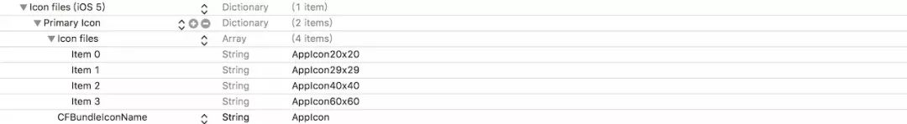
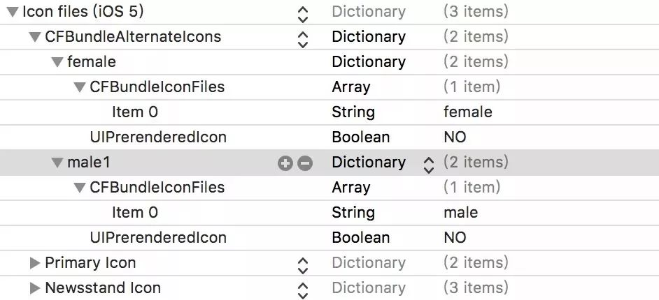

# iOS 动态更换icon

## 为什么要支持动态更换APP icon？

1. 逢年过节想换个应景的App图标，不用在进行发版了
2. 公司有个重大活动需要更换图标，不用担心活动前不能成功发版上线了

注意：我们更换的不只是APP的图标，还有通知栏的中的图标，以及设置界面中的图标等所有与我们 App 有关的图标。


## 如何更换icon？

1. 准备要更换的icon （iOS 10.3 以后才支持这个功能哦）

   将我们需要更换的图标放到我们的项目目录中（因为放到.xcassets中不管用），图片的命名建议以下面的方式命名，例如：xx20x20@2x.png，xx20x20@3x.png…这样在填写Info.plist时也会省事很多。



PS：其实对于更换的图标，我们也可以只提供一张，但命名时，我们就不要填写具体的尺寸了，只保留图片名字即可，例如：xx@2x.png，xx@3x.png， 但是效果上可能不如准备一整套的效果好。毕竟把一张桌面图标大小的图片塞到通知图标那么小的框里，图片会压缩

修改Info.plist

想要实现换图标的功能，Info.plist 文件的修改是很重要的一步。



CFBundleIcons:一个字典，包含所有AppIcon信息，即上图的Icon files(iOS 5)

CFBundlePrimaryIcon:如果已经在Assets.xcassets中设置了AppIcon，那么CFBundlePrimaryIcon中的配置会被忽略，Assets.xcassets的AppIcon将会自动配置到CFBundlePrimaryIcon中。

CFBundleAlternateIcons:一个数组，负责配置可供替换的icon信息

UIPrerenderedIcon:是否已经预渲染，如果不设置该项或者设为NO。系统会自动为icon进行渲染增加光泽

如果想详细了解CFBundleIcons, CFBundlePrimaryIcon, CFBundleAlternateIcons，请查看附件2

如果iPad需要也需要更换图标，那么我们需要在CFBundleIcons~ipad进行同样的设置。

注： 不能把图片放在.xcassets里面


## 编写代码

通过查看文档，我们可以看到下面几个属性和方法

```
// If false, alternate icons are not supported for the current process.
// 检查是否支持更换图标
@property (readonly, nonatomic) BOOL supportsAlternateIcons NS_EXTENSION_UNAVAILABLE("Extensions may not have alternate icons") API_AVAILABLE(ios(10.3), tvos(10.2));

// Pass `nil` to use the primary application icon. The completion handler will be invoked asynchronously on an arbitrary background queue; be sure to dispatch back to the main queue before doing any further UI work.
// 更换图标
- (void)setAlternateIconName:(nullable NSString *)alternateIconName completionHandler:(nullable void (^)(NSError *_Nullable error))completionHandler NS_EXTENSION_UNAVAILABLE("Extensions may not have alternate icons") API_AVAILABLE(ios(10.3), tvos(10.2));

// If `nil`, the primary application icon is being used.
// 当前图标的名称
@property (nullable, readonly, nonatomic) NSString *alternateIconName NS_EXTENSION_UNAVAILABLE("Extensions may not have alternate icons") API_AVAILABLE(ios(10.3), tvos(10.2));

```

系统提供的 API 简单明了，唯一要注意的是下面这个方法。

```
- (void)setAlternateIconName:(nullable NSString *)alternateIconName completionHandler:(nullable void (^)(NSError *_Nullable error))completionHandler
```

方法中的alternateIconName参数，是要填写您在Info.plist 中填写的名字，如图二中所示，我们应当在此方法中填写female或者male1.

为了方便大家使用，我将更换图标相关的代码已经写好在下面，AppIconManager。

```
@interface AppIconManager : NSObject

/**
 Returns the name of the icon currently in use.

 * If ``, the primary application icon is being used. Or the current system version is not supported.
 @return IconName
 */
+ (NSString *)getCurrentAppIconName;

/**
 Check whether the current device supports changing icon

 @return result, YES or NO
 */
+ (BOOL)canChangeAppIcon;

/**
 Change the icon

 * Pass `nil` to use the primary application icon. The completion handler will be invoked asynchronously on an arbitrary background queue; be sure to dispatch back to the main queue before doing any further UI work.
 @param iconName iconName
 @param completionHandler error or nil
 */
+ (void)changeAppIconWithIconName:(NSString *)iconName completionHandler:(nullable void (^)(NSError *_Nullable error))completionHandler NS_EXTENSION_UNAVAILABLE("Extensions may not have alternate icons");

@end
```

```
#import "AppIconManager.h"
#import "AppDelegate.h"

@implementation AppIconManager

+ (NSString *)getCurrentAppIconName {
    if (@available(iOS 10.3, *)) {
        return ([UIApplication sharedApplication].alternateIconName.length == 0) ? @"" : [UIApplication sharedApplication].alternateIconName;
    } else {
        // Fallback on earlier versions
        return @"";
    }
}

+ (BOOL)canChangeAppIcon {
    if (@available(iOS 10.3, *)) {
        return [[UIApplication sharedApplication] supportsAlternateIcons];
    } else {
        // Fallback on earlier versions
        return NO;
    }
}

+ (void)changeAppIconWithIconName:(NSString *)iconName completionHandler:(void (^)(NSError * _Nullable))completionHandler {
    if (@available(iOS 10.3, *)) {
        [[UIApplication sharedApplication] setAlternateIconName:iconName completionHandler:^(NSError * _Nullable error) {
            if (!error) {
                completionHandler(nil);
            } else {
                completionHandler(error);
            }
        }];
    } else {
        // Fallback on earlier versions
        NSDictionary *userInfo = @{
                                   NSLocalizedDescriptionKey: NSLocalizedString(@"AppIcon change failed", nil),
                                   NSLocalizedFailureReasonErrorKey: NSLocalizedString(@"The current system version does not support replacing the AppIcon.", nil),
                                   NSLocalizedRecoverySuggestionErrorKey: NSLocalizedString(@"", nil)
                                   };
        NSError *error = [NSError errorWithDomain:@""
                                             code:34001
                                         userInfo:userInfo];
        completionHandler(error);
    }
}
@end

```

附件：

https://developer.apple.com/design/human-interface-guidelines/ios/icons-and-images/app-icon/


https://developer.apple.com/library/archive/documentation/General/Reference/InfoPlistKeyReference/Articles/CoreFoundationKeys.html#//apple_ref/doc/uid/TP40009249-SW10