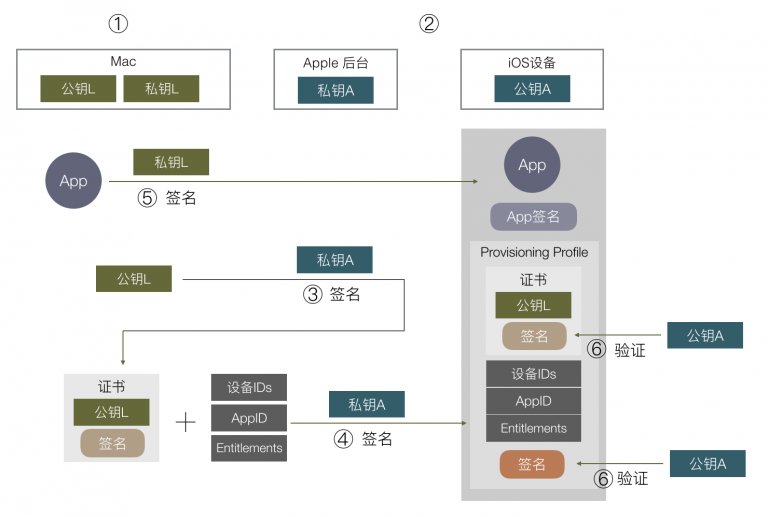
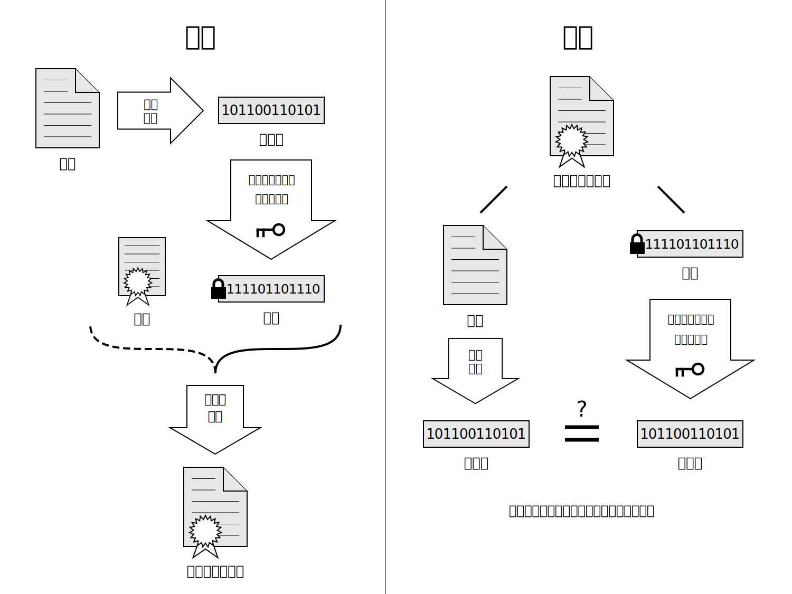
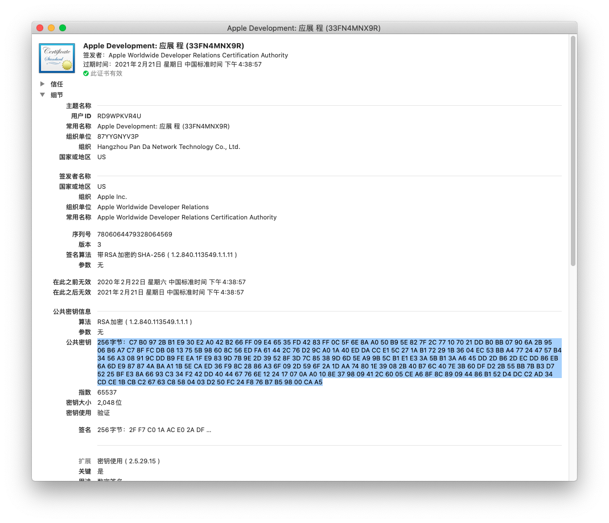
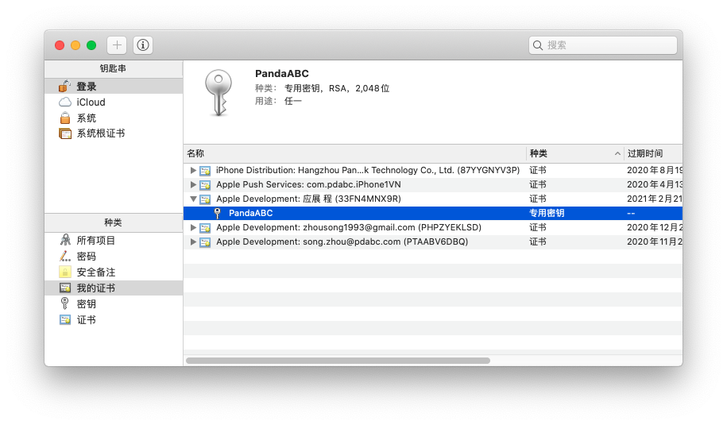

# iOS 签名原理

## 非对称加密
简而言之，就是私钥加密的数据必须由对应的公钥解密，公钥加密的数据必须由对应的私钥解密。

## 数字证书
为了理解数字证书，先要理解数字签名。

根据维基百科:
> 数字签名（英语：Digital Signature，又称公钥数字签名）是一种功能类似写在纸上的普通签名、但是使用了公钥加密领域的技术，以用于鉴别数字信息的方法。
> 一套数字签名通常会定义两种互补的运算，一个用于签名，另一个用于验证。

也就是说一段数据被数字签名后，那么就可以确定这段数据由签名方保证，是没有被修改过的。

参考下图：

而数字证书，根据维基百科对[数字证书](https://zh.wikipedia.org/wiki/公開金鑰認證)的定义：
> 简而言之，认证机构用自己的私钥对需要认证的人（或组织机构）的公钥施加数字签名并生成证书，即证书的本质就是对公钥施加数字签名

就是对公钥施加数字签名，保证公钥的身份有效性。

## iOS 签名

这是讨论的是非 AppStore 版本的签名

### ① 本地公私钥
从 Xcode 那边申请证书，或从团队其他成员中获取到证书

比如证书 33FN4MNX9R：

可以看到证书中的原始公钥（高亮部分），签名方（Apple Worldwide Developer Relations），签名后的公钥（公共密钥-签名）。

私钥:

keychain 会对证书的公钥和对应的私钥做关联

## ② Apple 公私钥
私钥在 Apple 后台，公钥在每个 iOS 设备中。

## ③ 对本地公钥签名 
本地公钥被传到 Apple 后台后，会用 Apple 的私钥对本地公钥签名，用来验证本地公钥的合法性。
生成一份证书，里面包含本地公钥和签名。就是上面提到的证书 33FN4MNX9R

## ④ 再签名生成 Provisioning Profile
这里有个 Provisioning Profile 的概念，里面会包含第三步的证书，苹果后台申请 AppID，配置好设备 ID 列表和 APP 可使用的权限。
这些组合在一起的数据会用 Apple 的私钥再签名一次。

## ⑤ 签名 App
用本地私钥对 app 签名。然后把 Provisioning Profile 打包到 app 里。

## ⑥ 验证
1. 通过 Apple 的公钥验证 Provisioning Profile 和里面的证书。
2. 通过证书中的公钥（本地公钥）验证 app 的签名
3. 验证设备的 ID 是否在 Provisioning Profile 的 ID 列表中，AppID 是否对应得上，权限开关是否跟 APP 里的 Entitlements 对应等。

# 参考
- [iOS App 签名的原理](http://blog.cnbang.net/tech/3386/)
- [Maintain Signing Assets](https://help.apple.com/xcode/mac/current/#/dev3a05256b8)