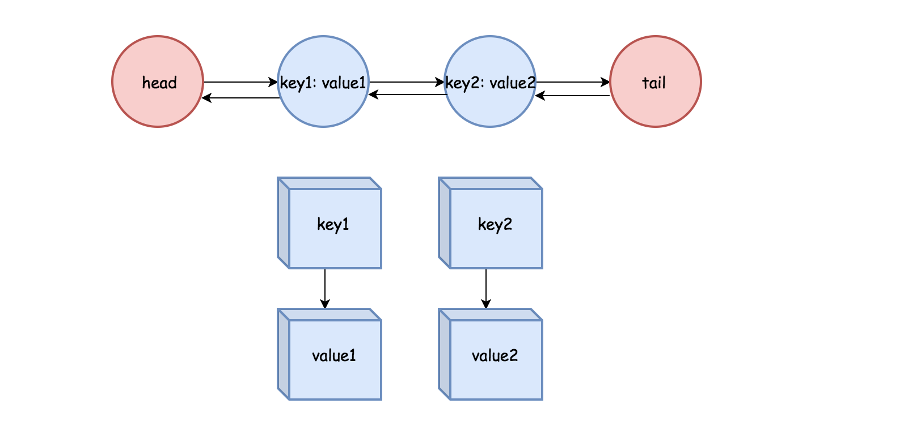

LRU 缓存机制

LRU 是一种缓存机制，英文全称是 Least Recently Used，就是最近最少使用的意思。
在缓存空间占满时，会先删除最先插入的对象。

我们可以实现这样一个 LRU 缓存，支持 O(1) 的时间复杂度插入对象，访问对象。

# 原理
首先想到的是把所有缓存对象连在一起，添加的时候往头部添加，移除的时候从尾部开始，这样就能保证先移除最久未使用的对象。

```
head -> 1 -> 2 -> 3 -> tail

```

这样有两个问题：
1. 我要访问 3，需要从 head 开始遍历，时间复杂度是 O(n)
2. 我要删除 3，也需要从 head 开始遍历，时间复杂度是 O(n)

很明显不满足访问对象 O(1) 复杂度的要求。

单链表不满足要求，很容易想到用双链表来实现删除节点 O(1) 复杂度的要求，类似于这样的：

```
// head 指向 1，1 指向 head，以此类推
head -> 1 -> 2 -> 3 -> tail
     <-   <-   <-   <-

```

比如我想删除 2，在获取到 2 的前提下，只需要改变 2 的前驱节点 1 指向 2 的后驱节点 3，改变 2 的后驱节点 3 指向 2 的前驱节点 1 就行了。


虽然删除节点可以在 O(1) 下进行，但是访问一个节点还是要遍历整个链表。


这时候就需要辅助使用另外一个数据结构字典在插入缓存对象的时候来保存每个对象，使访问时间达到 O(1) 的操作。

整个结构如图：


# 实现

完整项目在 `SZLRUCache` 目录下，有单元测试可以运行。

## Node

`SZLRUCacheNode` 是缓存对象节点，有一个 `key` 做关联，`value` 保存实际的缓存内容。`next` 是后驱指针，`prev` 是前驱指针

```objc
@interface SZLRUCacheNode : NSObject

@property (nonatomic) id value;
@property (nonatomic, readonly) id key;
@property (nullable, nonatomic) SZLRUCacheNode *next;
@property (nullable, nonatomic) SZLRUCacheNode *prev;

+ (instancetype)nodeWithValue:(id)value key:(id)key;
- (instancetype)initWithValue:(id)value key:(id)key;

@end
```

## LRUCache

`SZLRUCache` 是实际执行缓存的对象。

```objc
@interface SZLRUCache ()

/// 保存节点的字典，只是为了快速访问
@property (nonatomic) NSMutableDictionary<id, SZLRUCacheNode *> *dictionary;

/// 占位的头部节点，不保存具体的值，方便统一操作逻辑
@property (nonatomic) SZLRUCacheNode *head;
/// 占位的尾部节点，不保存具体的值，方便统一操作逻辑
@property (nonatomic) SZLRUCacheNode *tail;

/// 缓存大小，也就是允许的缓存对象数量
@property (nonatomic) NSUInteger size;
/// 缓存操作执行的队列，串行
@property (nonatomic) dispatch_queue_t queue;

@end
```

### 插入缓存对象

```objc
- (void)setObject:(id)object forKey:(id)key {
    NSParameterAssert(object);
    
    dispatch_async(self.queue, ^{
        SZLRUCacheNode *node = self.dictionary[key];
        
        if (node == nil) { // 缓存不存在，就创建一个节点
            SZLRUCacheNode *newNode = [SZLRUCacheNode nodeWithValue:object key:key];
            
            // 在字典中记录，用来快速访问
            self.dictionary[key] = newNode;
            // 添加节点
            [self addNode:newNode];
             // 缓存容量 +1
            self.size += 1;
            // 检查有没有超过缓存容量，超过需要移除最久未使用的缓存对象
            [self checkSpace];
        } else {
        	// 缓存存在，更新缓存内容
            node.value = object;
            /// 有被访问过，移到链表头部，降低被移除的优先级
            [self moveToHead:node];
        }
    });
}
```

### 访问缓存对象
```objc
- (id)objectForKey:(id)key {
    __block SZLRUCacheNode *node = nil;
    
    /// 同步进行，如果异步执行，还没获取到就返回了
    dispatch_sync(self.queue, ^{
    /// 因为字典有记录，所以直接获取
        node = self.dictionary[key];
        
        /// 有被访问过，移到链表头部，降低被移除的优先级
        if (node) {
            [self moveToHead:node];
        }
    });
    
    return node.value;
}
```

### 节点操作

添加节点，在 head 后面插入，并调整相应节点前驱，后驱指针。

```objc
/// add the new node right after head
/// @param node node to be added

- (void)addNode:(SZLRUCacheNode *)node {
    node.prev = _head;
    node.next = _head.next;
    
    _head.next.prev = node;
    _head.next = node;
}
```

删除节点, O(1) 操作

```objc
//  remove an existing node from the double linked list
/// @param node node to be removed
- (void)removeNode:(SZLRUCacheNode *)node {
    node.prev.next = node.next;
    node.next.prev = node.prev;
}
```

移动节点到头部

```objc
- (void)moveToHead:(SZLRUCacheNode *)node {
    [self removeNode:node];
    [self addNode:node];
}
```

从尾部删除节点
```objc
 (SZLRUCacheNode *)popTail {
    SZLRUCacheNode *node = self.tail.prev;
    [self removeNode:node];
    
    return node;
}
```

检查容量
```objc
- (void)checkSpace {
    if (self.size > self.capacity) {
        SZLRUCacheNode *tail = [self popTail];
        
        [self.dictionary removeObjectForKey:tail.key];
        self.size -= 1;
    }
}
```
