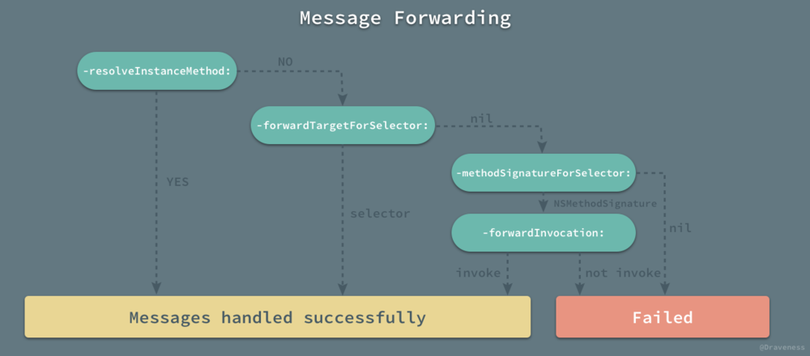

WeakProxy

处理循环引用有很多方法，比如 weak-strong dance，通过在 block 中持有 `__weak` 修饰的变量来实现。

这里介绍一种通过一个临时变量来解决的思路，用的是 `NSProxy`，相比于 `NSObject` 更加轻量级，当然也可以用 `NSObject` 来做。

# 案例
有一个 `TimerViewController`，持有 `timer` 这个实例变量，`timer` 在初始化方法中指定 `target` 为 self，这样就会有一个循环引用。

self -> timer -> self

```objc
@interface TimerViewController ()

@property (nonatomic) NSTimer *timer;

@end

@implementation TimerViewController

- (void)viewDidLoad {
    [super viewDidLoad];

    _timer = [NSTimer scheduledTimerWithTimeInterval:1.0
                                              target:self
                                            selector:@selector(handleTimer:)
                                            userInfo:nil
                                             repeats:YES];
}

- (void)dealloc {
	// 不会进入
}

...
```

如果 self 不持有 `timer`，也还有 Runloop 持有它，也不会进入 `dealloc` 方法

Runloop -> timer -> self

## 消息转发机制回顾

在介绍 weakProxy 解决方法之前，需要先回顾一下 OC 消息转发机制。



当一个 NSObject/NSProxy 对象响应不了一个消息时，会调用 `resolveInstanceMethod:`，这里可以动态的对一个 selector 提供实现，比如：

```objc
void dynamicMethodIMP(id self, SEL _cmd)
{
    // implementation ....
}

+ (BOOL) resolveInstanceMethod:(SEL)aSEL
{
    if (aSEL == @selector(resolveThisMethodDynamically))
    {
          class_addMethod([self class], aSEL, (IMP) dynamicMethodIMP, "v@:");
          return YES;
    }
    return [super resolveInstanceMethod:aSel];
}

```

如果还是处理不了消息，就会调用 `forwardingTargetForSelector:`, 这里可以提供新的 target，把消息都转发给这个对象。

如果没有 target 可以处理这个消息，就会接着调用 `methodSignatureForSelector:` 返回 selector 的方法签名，然后调用 `forwardInvocation:` 做最后的处理。

`forwardInvocation:` 可以转发消息到其他对象，多个对象同时接受消息，设置返回值等。


```objc
- (void)forwardInvocation:(NSInvocation *)invocation
{
    SEL aSelector = [invocation selector];
 
    if ([friend respondsToSelector:aSelector])
        [invocation invokeWithTarget:friend];
    else
        [super forwardInvocation:invocation];
}
```

NSObject 的默认实现是调用 `doesNotRecognizeSelector:` 方法，也就是会抛出异常。

## weakProxy 解决方法

weakProxy 的处理思路是创建一个 `NSProxy` 子类:

```objc
@interface WeakProxy : NSProxy

+ (instancetype)weakProxyForObject:(id)targetObject;
    
@end

@implementation WeakProxy {
    __weak id _target;
}

/// WeakProxy 指定的创建方法
/// 作为 NSProxy 的子类，不响应也不需要 `-init`
/// @param targetObject 实际响应消息的对象
+ (instancetype)weakProxyForObject:(id)targetObject {
    WeakProxy *proxy = [WeakProxy alloc];
    proxy->_target = targetObject;

    return proxy;
}
...
```


参与消息转发机制：

```objc
/// 返回实际的消息响应对象
- (id)forwardingTargetForSelector:(SEL)aSelector {
    return _target;
}
```


```objc
/// 模拟 objc 发送消息返回 nil 的行为
///
/// 在 `_target` 被销毁后， `forwardingTargetForSelector:` 返回 nil，然后会调用这个方法。
/// 这里返回一个无用的方法签名防止 `doesNotRecognizeSelector:` 被调用
- (NSMethodSignature *)methodSignatureForSelector:(SEL)sel {
    return [NSObject instanceMethodSignatureForSelector:@selector(init)];
}

/// 返回 0/NULL/nil，防止 `doesNotRecognizeSelector:` 被调用
- (void)forwardInvocation:(NSInvocation *)invocation {
    void *nullPointer = NULL;
    [invocation setReturnValue:&nullPointer];
}
```

实际使用：

```objc
- (void)viewDidLoad {
    [super viewDidLoad];

    _timer = [NSTimer scheduledTimerWithTimeInterval:1.0
                                              target:[WeakProxy weakProxyForObject:self]
                                            selector:@selector(handleTimer:)
                                            userInfo:nil
                                             repeats:YES];
}

- (void)dealloc {
    [_timer invalidate];
}

```


