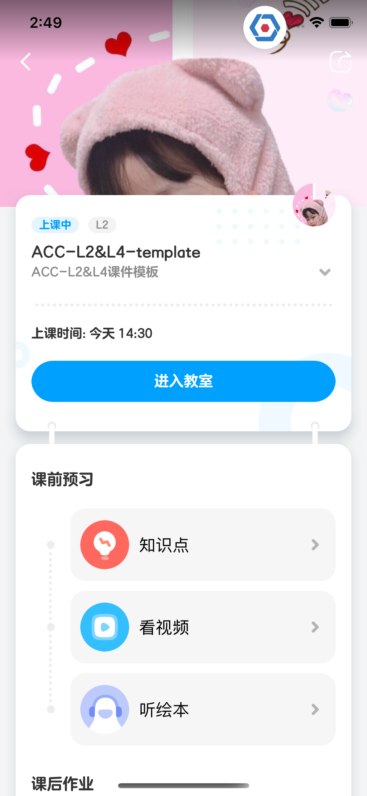
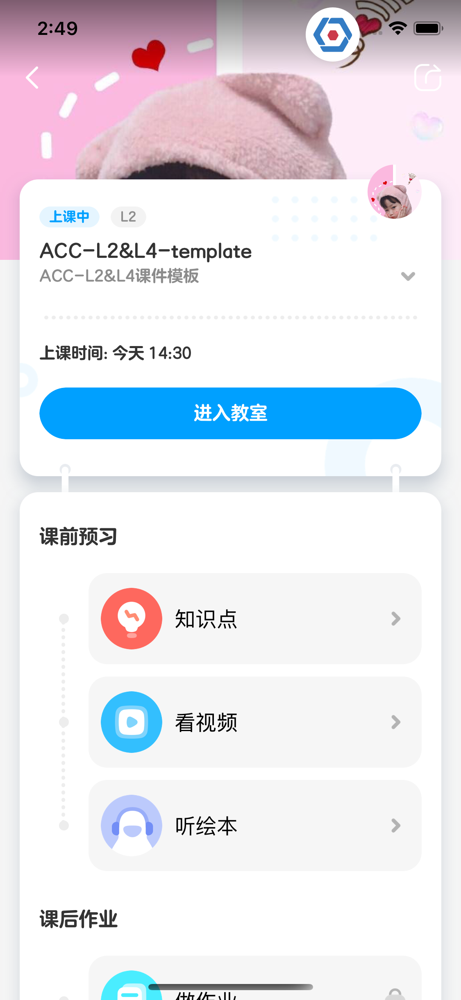
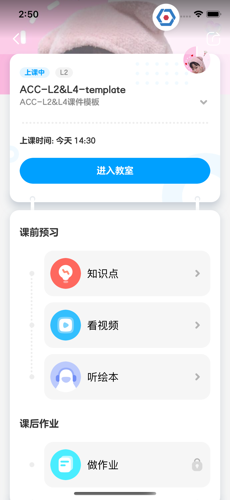
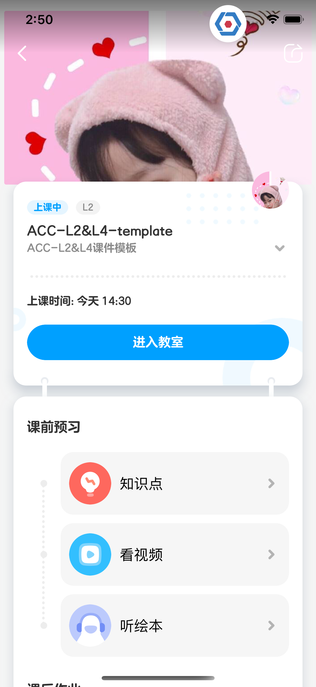

# 问题

这个问题是我在做课程详情页面碰到的，课程详情页面由两个 UIScrollView 组成。如图


最外层有一个 ScrollView，frame 大小为 ViewController view 的大小，还有一个包含课程信息，课前预习，课后作业卡片的 ScrollView，两者是 subView 关系。

内层 scrollView 可以独立向上滑动，最多滑到下图的位置，外层 scrollView 位置不动：


但是如果继续往上滑动，可以滑动最外层 scrollView，内层 scrollView 不动。


当然在一定位置后继续往下滑动，也会只滑动外层 scrollView。


# 解决方案

思路是滑动内层 scrollView 的时候，在指定位置设置 内/外层 scrollView 的 contentOffset 为 0，这样就有独立滑动的效果。

因为 scrollView 的滑动手势 delegate 必须设置到自身，所以这里要子类化 UIScrollView 来处理手势的代理。

设置允许同时滑动，否则最内层 scrollView 在滑动时收不到 `scrollViewDidScroll` 的回调。
```swift
class CustomScrollView: UIScrollView, UIGestureRecognizerDelegate {
    func gestureRecognizer(_ gestureRecognizer: UIGestureRecognizer, shouldRecognizeSimultaneouslyWith otherGestureRecognizer: UIGestureRecognizer) -> Bool {
        return true
    }
}
```

然后设置两个 ScrollView 的代理，接受 `scrollViewDidScroll` 的回调：

```swift
 func scrollViewDidScroll(_ scrollView: UIScrollView) {
 		/// 需要加上外层 scrollView 的 offset，这样的 offset 是体现实际的偏移，而不是相对于自身的 UIScrollView
        let offSetY = self.scrollView.contentOffset.y+self.childScrollView.contentOffset.y
        /// insetTop 是内层 scrollView 可以独立滑动的范围
        let insetTop = self.childScrollView.contentInset.top

        let childEnable: Bool
        if offSetY >= 0 { // 往上滑动到顶部了，不允许内层 scrollView 滑动
            childEnable = false
        }else if offSetY < 0 && offSetY > -insetTop { // 内层 scrollView 滑动的范围在 insetTop 里
            childEnable = true
        } else { // 往下滑动超过了 insetTop，也不允许内层 scrollView 滑动
            childEnable = false
        }

        if scrollView == self.childScrollView {
            if childEnable == false && offSetY > 0 { // 内层 scrollView 内容往上滑动超出 frame，把 contentOffset.y 设回 0
                self.childScrollView.contentOffset.y = 0
            }
        } else if scrollView == self.scrollView {
            if childEnable { // 内层 scrollView 可以独立滑动的时候，把外层 contentOffset.y 设回 0，视觉上没有滑动
                 self.scrollView.contentOffset.y = 0
            }
        }
    }
```