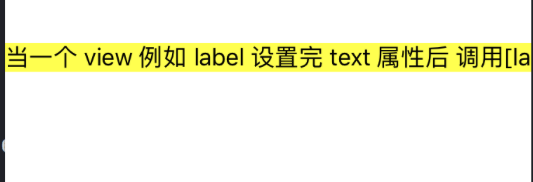
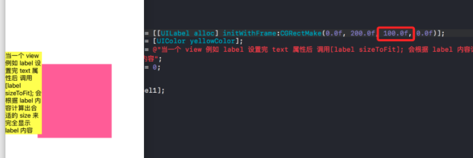
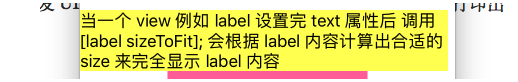

#  sizeThatFits 和 sizeToFit的区别

## 1.sizeThatFits 和 sizeToFit的区别

UIView 有个 sizeToFit 方法来计算 UIView 合适的 bounds.size, 注意 autolayout 约束过的 view 该方法失效.

```
- (void)sizeToFit;           
// calls sizeThatFits: with current view bounds and changes bounds size.
调用这个方法会改变当前 view 的 bounds.size 

```

```
- (CGSize)sizeThatFits:(CGSize)size;     // return 'best' size to fit given size. does not actually resize view. Default is return existing view size
// 意思大概是 返回“最佳”大小适合给定的大小 默认返回已经存在的视图 size
```

当一个 view 例如 label 设置完 text 属性后 调用[label sizeToFit]; 会根据 label 内容计算出合适的 size 来完全显示 label 内容


```
    UILabel *label1          = [[UILabel alloc] initWithFrame:CGRectMake(0.0f, 100.0f, 0.0f, 0.0f)];
    label1.backgroundColor   = [UIColor yellowColor];
    label1.text              = @"当一个 view 例如 label 设置完 text 属性后 调用[label sizeToFit]; 会根据 label 内容计算出合适的 size 来完全显示 label 内容";
    label1.numberOfLines     = 0;
    [label1 sizeToFit];
    
    [self.view addSubview:label1];

```

 




上边的方法 如果不设定 label 的 frame.size.with 那么 label 会自适应宽度 而不会改变它的高度,所以 label 虽然设置了 numberOfLines = 0 ,依然无法换行 .大部分应用当文字一行显示不完全时需要给 label 换行,那么就要限定 label 的 maxWidth

还是同样的代码 由于我指定了 label 的 width = 100.0f ,在 [label sizeToFit] 会发现 label 的最大 with =100 显示不完全部分换行 高度自适应.



所以 sizeToFit 并不能够完全按我们设想的哪样去自适应 label 的 bounds.size

那么 sizeToFit 内部到底做了哪些操作呢?

其实当调用 UIView 的 sizeToFit 后 会调用 sizeThatFits 方法来计算 UIView 的 bounds.size 然后改变 frame.size

```
 UIView 的 - (CGSize)sizeThatFits:(CGSize)size {
    
    CGSize newSize = [super sizeThatFits:size];
    NSLog(@"size =%@",NSStringFromCGSize(newSize));
    
    return newSize;
    
}
不妨将上边代码部分发 UILabel 改成子类化的 MyLabel 重写sizeThatFits 打印出  newSize ={99, 223.5}

```

其实我们也可以不使用 [ label sizeToFit] 来计算 label 内容的 size ,首先调用 sizeThatFits 方法或者一个 CGSize 然后改变 label.frame.size 就可以得到 [label sizeToFit]一样的效果

```
 // 或者给一个限定的宽度和高度 让 label 在这个范围内进行自适应 size
    CGSize labelSize = [label1 sizeThatFits:CGSizeMake([[UIScreen mainScreen] bounds].size.width, MAXFLOAT)];
    CGRect rect      = CGRectMake(label1.frame.origin.x, label1.frame.origin.y, labelSize.width, labelSize.height);
    [label1 setFrame:rect];

```



由此可见 sizeThatFits 比 sizeToFit 更加灵活的设置一个自适应size 的 view , 可以定制 label 计算内部内容的规则

下边是重写子类 sizeThatFits 自定义的一个 计算label siztToFit 后改变 frame.size 的方法

当你调用 自定义 View 的 sizeToFit 方法后 会根据自定义的 sizeThatFits:(CGSize)size 规则来计算 label 来改变 label 完全内容的 size


