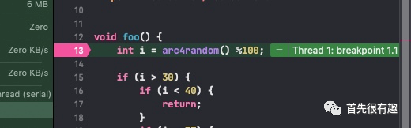
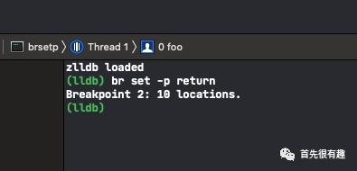
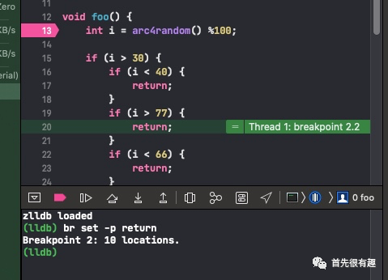

# 如何在断点中找函数的return

先看一段代码。

```
void foo() {
    int i = arc4random() %100;
    
    if (i > 30) {
        if (i < 40) {
            return;
        }
        if (i > 77) {
            return;
        }
        if (i < 66) {
            return;
        }
    }
    
    switch (i) {
        case 0:
            return;
        case 1:
            return;
        case 2:
            return;
        case 3:
            return;
        case 4:
            return;
        default:
            return;
    }
}

int main(int argc, const char * argv[]) {
    foo();
    return 0;
}
```


我们可以看到 foo() 函数中，return 的地方非常多，达到 9 个。有时候在调试的时候需要快速定位 return 的地方，就会比较麻烦。那有什么比较方便的方法，能快速定位 return 的位置吗？

## 方法


第一步：在 foo 的第一行加断点



第二步：当断点触发后，在控制台输入

```
breakpoint set -p return
// 或者使用
// br 是 breakpoint 的缩写
br set -p return
```



第三步：continue，继续运行程序，断点就会定位到 return 那一行 啦




Done!