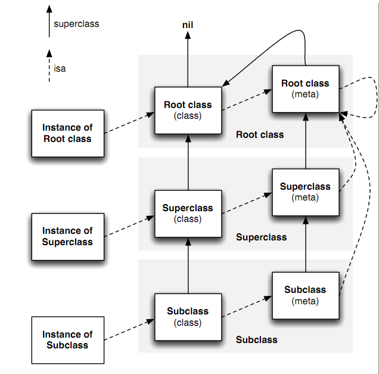

# 一个NSObject 对象占用多少内存？

```objective-c
// NSObject Implementation
struct NSObject_IMPL {
    Class isa; // 8个字节
};
// 指针
// typedef struct objc_class *Class;

int main(int argc, const char * argv[]) {
    @autoreleasepool {
        NSObject *obj = [[NSObject alloc] init];
        
        // 获得NSObject实例对象的成员变量所占用的大小 >> 8
        NSLog(@"%zd", class_getInstanceSize([NSObject class]));
        
        // 获得obj指针所指向内存的大小 >> 16
        NSLog(@"%zd", malloc_size((__bridge const void *)obj));
    
    }
    return 0;
}

```


如上代码：我们初始化一个NSObject 对象， 转化成一个 C/C++ 代码 我们发现 NSObject 对象本质是一个结构体，里面包含一个 isa 指针， 所以在64位环境下，指针分配的内存大小为8个字节， 所以 获得的 NSobject 实例对象的成员变量所占用的内存大小则为8个字节。 我们可以通过 class_getInstanceSize 函数 打印出来的结果也是8个字节 与我们的想法一致。 但是 我们通过 C 函数的 malloc_size 方法发现 打印出来 获得obj指针所指向内存的大小 则为16个字节。 通过源码 发现 如下代码：

`if (size < 16) { size = 16} return size;`

所以我们得出结论：在64位环境下  获得NSObject实例对象的成员变量所占用的大小 为 8个字节  获得obj指针所指向内存的大小则为 16个字节


## 对象的isa 指针 指向哪里？

如上我们发现一个NSobject对象的本质的就是结构体，里面只包含了 一个指向结构体的isa指针，那么对象的isa指针 指向的又是哪里呢？



查询文档我们发现：

isa 指的就是 是个什么，对象的isa指向类，类的isa指向元类（meta class），元类isa指向元类的根类。isa帮助一个对象找到它的方法。
isa：是一个Class 类型的指针. 每个实例对象有个isa的指针,他指向对象的类，而Class里也有个isa的指针, 指向meteClass(元类)。元类保存了类方法的列表。当类方法被调用时，先会从本身查找类方法的实现，如果没有，元类会向他父类查找该方法。同时注意的是：**元类（meteClass）也是类，它也是对象。**元类也有isa指针,它的isa指针最终指向的是一个根元类(root meteClass).根元类的isa指针指向本身，这样形成了一个封闭的内循环。