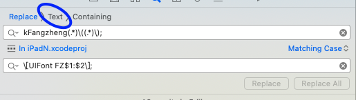

# 使用正则表达式在Xcode中提升查找和替换效率

平时，大家都应该使用过 Xcode 的全局内容查找和替换功能。

## 问题

```
kFangzhengRegular(_numLabel.height)
kFangzhengBold(18.0f)
```

我想将上面的代码替换成下面的形式，请问可以使用什么方法？

```
[UIFont FZRegular:(_numLabel.height)]
[UIFont FZBold:18.0f]
```

显然，普通的搜索替换功能是行不通了。

正确的做法是使用正则表达式

## 实现方法

如何切换至正则替换？




输入字符如下：

```
// 查找栏
kFangzheng(.*)\((.*)\)
// 替换栏
\[UIFont FZ$1:$2\]
```

对上面的内容，做一下解释：

1. ( ) 标记一个子表达式的开始和结束位置，.*  就是单个字符匹配任意次,即贪婪匹配。因此第一个 (.*) 可以匹配到 Regular 和  Bold，第二个 (.\*) 可以匹配到任意数字
2. 由上所说 () 属于正则表达式中的特殊字符，因此如果想要匹配 ( 和 )，必须使用转义符 \，即 \\( 和 \\)。更多特殊字符看参考[网站](https://www.runoob.com/regexp/regexp-syntax.html)
3. 再来看替换栏， [ 和 ] 也属于特殊字符，因此也需要使用 \ 转义
4. \$1 和 \$2 意为查找栏中，匹配到的第一个值和第二个值

点击 Replace All，Done！