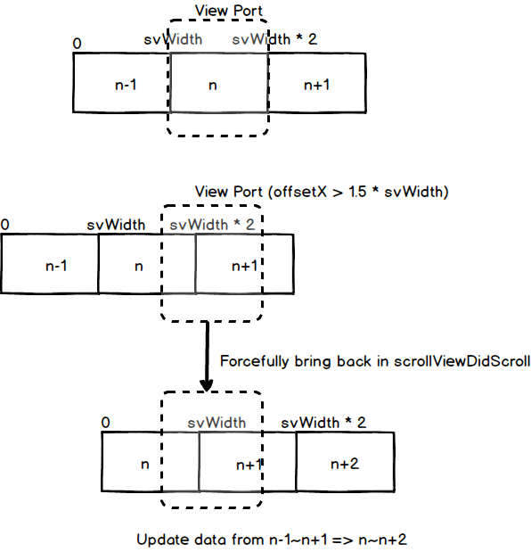
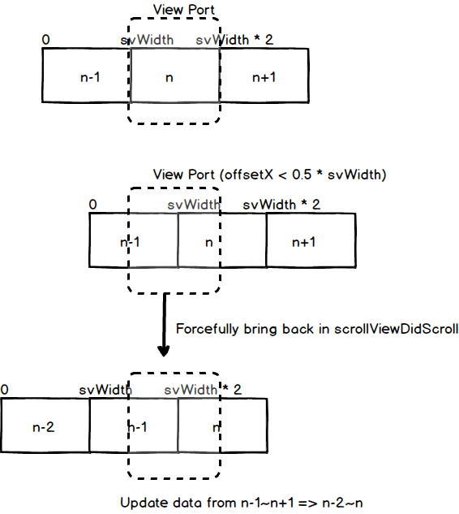

无限滑动 UIScrollView

无限滑动的 UIScrollView 的需求其实挺常见，比如无限轮播图，滑到最后一张图后，再滑动，会显示第一张图片。

这里介绍的是一种通过改变图片位置顺序和 UIScrollView contentOffset 来实现无线滑动的方法


# 实现

这里需要假设每一个 page 的大小需要大于等于 scrollView 宽或高（取决于左右还是上下滑动），一般 3 个 page 就足以实现无限滑动了。

demo 上的是上下滑动，因为项目中的是上下滑动。

## 左滑

图片上显示的是左右滑动，上下滑动原理一样



虚线是 scrollView 的 frame，当往左滑动时，offsetX 越来越大，当大于 1.5 倍 scrollView 宽度时，就需要把第一个 page 移到最后。

对应到代码实现：

```swift
func scrollViewDidScroll(_ scrollView: UIScrollView) {
	let offsetY = scrollView.contentOffset.y
	
	if (fetcher.canScrollToEnd() && offsetY > pageHeight * 1.5) {
		let next = fetcher.fetchNextImage()
		images.remove(at: 0)
		images.append(next)
		/// 会把图片的 frame 按顺序从 （0,0）重新排列
		layoutImages()
		
		/// 保持滑动位置不变
		scrollView.contentOffset.y -= pageHeight
	}
}
```

## 右滑



offsetX 小于 0.5 倍 scrollView 宽度时，也就是当前最左边 page 滑动了大于一半，这时候需要把最右边 page 移到最左边。

```swift
func scrollViewDidScroll(_ scrollView: UIScrollView) {
	if (fetcher.canScrollToStart() && offsetY < pageHeight * 0.5) {
		let prev = fetcher.fetchPrevImage()
		images.removeLast()
		images.insert(prev, at: 0)
		layoutImages()
		scrollView.contentOffset.y += pageHeight
	}
}
```

## 获取图片

知道了什么时候需要移动图片，还有一个关键是怎么取图片。

这里介绍一个 `func mod(_ left: Int, _ right: Int) -> Int` 函数，这是一个取模函数，支持负数取模。

```swift
 /**
     取模操作，支持负数
     
     example: mod 3
     4   3   2   1   0   -1  -2  -3  -4
     1   0   2   1   0   2   1   0   2
*/
private func mod(_ left: Int, _ right: Int) -> Int {
	guard right != 0 else {
		return -1
	}
	
	if left > 0 {
		return left % right
	}

	return mod(left+right, right)
}
```

有了取模函数，就可以在一个图片数组中循环获取图片了。


在左滑时，需要把最左边的图片移到最右边，对应于 `func fetchNextImage() -> UIImage` 函数。

考虑一个图片序列，0 1 2，手指往左移动，移除最左边，添加到最右边
```
0  1  2
1  2  0
2  0  1
0  1  2
```

currentIndex 变化：1, 2, 3, 4

需要添加的图片：
```
(1+2) mod 3 = 0
(2+2) mod 3 = 1
(3+2) mod 3 = 2
(4+2) mod 3 = 0
```

所以下一个图片：currentIndex+2 mod 3

对应到代码：

```swift
func fetchNextImage() -> UIImage {
	currentIndex += 1
	return fetchImageAt(index: mod(currentIndex+1, count))
}
```

右滑的情况类似：

```swift
func fetchPrevImage() -> UIImage {
	currentIndex -= 1
	return fetchImageAt(index: mod(currentIndex-1, count))
}
```

## 固定位置
现在已经实现了无限滑动，但需求还有能固定一端，比如滑动到最左边后，不能再往左滑动，但是还能无限往右滑动。

在上面的代码中，我其实已经添加了相关处理固定位置的代码

```swift
 if (fetcher.canScrollToEnd() && offsetY > pageHeight * 1.5) {
 ...
 }
 
 if (fetcher.canScrollToStart() && offsetY < pageHeight * 0.5) {
 ...
 }
```

假设有图片序列 0, 1, 2，用户处于 1 时，如果设置了左边固定，那么此时用户已经不需要再往左边插入 page 了

```swift
/**
	是否允许继续滑向顶部
	当 currentIndex=1 时，此时不再需要在前面插入 page
 */
func canScrollToStart() -> Bool {
	if stopAtStart == false {
		return true
	}
	
	return currentIndex > 1
}
```

右滑同理：

```swift
/**
	是否允许继续滑向底部
	当 currentIndex = count-2 时，此时不再需要在后面插入 page
 */
func canScrollToEnd() -> Bool {
	if stopAtEnd == false {
		return true
	}

	return currentIndex < count-2
}
```

