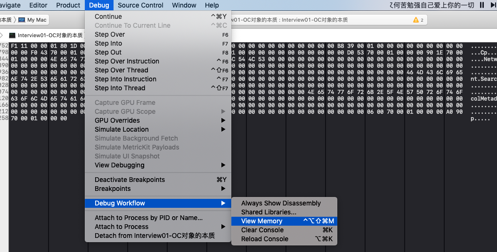
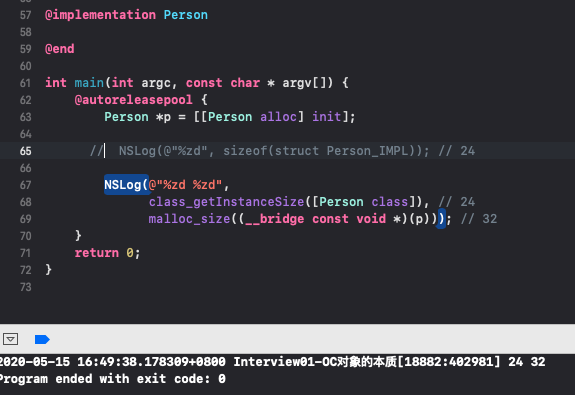
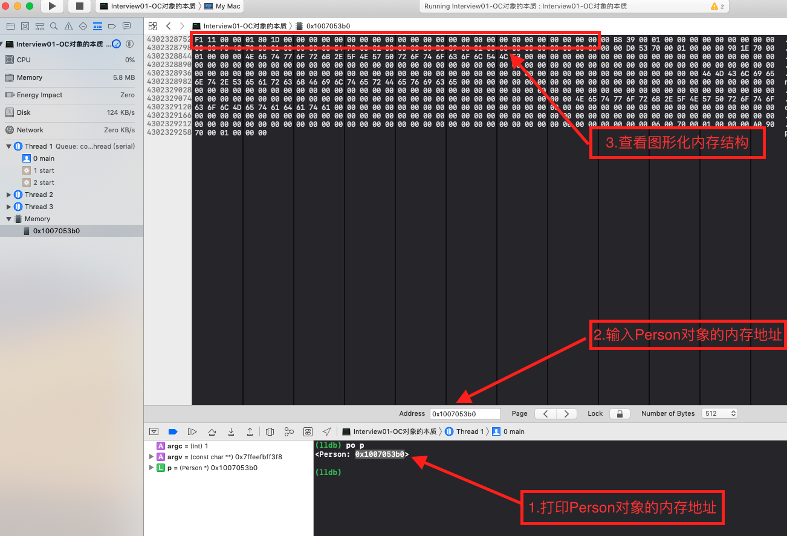

# Xcode Debug 下的 View Memory 的使用

## 如何使用？

##  示例代码

总结：如上图所示： 我们打印Person的对象的内存地址为 0x1007053b0  我们打开 View Memory 输入内存地址 发现 系统给 person 对象的分配的内存 为32个字节，（上图 F1 11 00 等 表示 8位 1个字节） 这和我们 用 malloc_size 函数打印出来的内存大小 相符合 