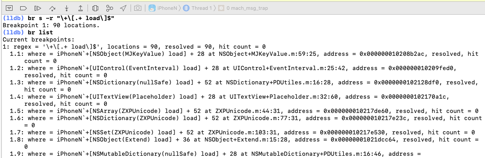

# 如何快速列出App的所有+load方法

有时候我们想看看，在工程中，代码中有重写了哪些类的 load 方法，就可以使用下面的方法

### LLDB

运行 App 时，暂停 App。

输入

```
// 含义是对双引号内的正则表达式打断点
br s -r "\+\[.+ load\]$"
```


随后，输入

```
br list
```

控制台会打印所有 load




