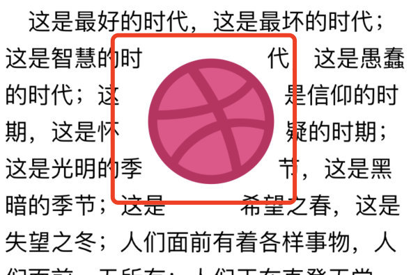

# 使用YYLabel+CADisplayLink实现文本首行缩进的动画效果

今天要讲的效果如下：


可以看到，当按钮出现的时候，文本会自动以动画的形式后移

先说常规写法：

```objc
NSMutableParagraphStyle *parag = [[NSMutableParagraphStyle alloc] init];
parag.firstLineHeadIndent = _isFollowed ? 100 : 0;
NSDictionary *attDic = @{NSFontAttributeName: font,
                         NSForegroundColorAttributeName: WTVPUGCProfilePlayView.videoTitleColor,
                         NSParagraphStyleAttributeName: parag};
NSAttributedString *attStr = [[NSAttributedString alloc] initWithString:videoTitle attributes:attDic];
self.titleLabel.attributedText = attStr;
```

这样写实现缩进是没有问题的，但是没有动画，接下来我们看一下动画怎么加上，这里要用到 YYLabel

#### 1. YYLabel - exclusionPaths

使用`YYLabel`的最大好处就是能异步绘制最大程度保持界面流畅，另外可以通过`YYLabel`的`exclusionPaths`属性实现缩进动画。

**`exclusionPaths`是`YYText`的用于设置文本空白区域的数组，可以存放多个`UIBezierPath`类型的元素，即规定的空白区域。** 



 对于首行缩进，只要创建一个原点为(0, 0)，宽度为已关注图标的最大x值+间距，高度不超过行高（宽高都不能为0，必须大于0，否则无效果）的`exclusionPaths`

```objc
// 刷新方法
- (void)updateTitleLabelExclusionPaths {
    if (self.pursueView) {  // 已关注
        // 1.获取图标最大x值+间距
        CGFloat w = self.pursueView.jp_maxX + _subviewSpace; 
        // 2.刷新 exclusionPaths。
        self.titleLabel.exclusionPaths = @[[UIBezierPath bezierPathWithRect:CGRectMake(0, 0, w, 1)]];
    } else {  // 没有关注
        // 移除 exclusionPaths
        self.titleLabel.exclusionPaths = nil; 
    }
}
```

**PS：想要动态修改`YYLabel`的`exclusionPaths`，则`ignoreCommonProperties`属性要为 NO。** 如果设置为YES，文本显示的属性诸如`text`、`font`、`textColor`、`attributedText`、`lineBreakMode`、`exclusionPaths`等将不可用，这是为了提高性能，尽可能将控件属性做静态处理。

#### 2. CADisplayLink

配合`CADisplayLink`，用于动画过程中跟踪已关注图标的位置变化，不过动画过程监听的并不是图标控件自身的属性，而是图标控件的`layer.presentationLayer`。

**presentationLayer是用于实时获取动画过程中的layout信息，如果控件不是在动画过程中，该属性为nil**（系统的动画API都是通过这个“假”的presentationLayer来呈现动画的，本体是直接就到了最终位置的，如果是POP这个库的动画本体才是实时变化的）。

##### 添加、移除CADisplayLink：

```objc
- (void)addLink {
    [self removeLink];
    // 执行updateTitleLabelExclusionPaths进行刷新
    self.link = [CADisplayLink displayLinkWithTarget:self selector:@selector(updateTitleLabelExclusionPaths)];
    [self.link addToRunLoop:[NSRunLoop mainRunLoop] forMode:NSRunLoopCommonModes];
}
- (void)removeLink {
    if (self.link) {
        [self.link invalidate];
        self.link = nil;
    }
}
```

##### 另外刷新方法得修改一下：

```objc
- (void)updateTitleLabelExclusionPaths {
    if (self.pursueView) {  // 已关注
        // 1.获取图标最大x值+间距
        CGFloat w = _subviewSpace
        if (self.link) {  // 如果CADisplayLink存在，说明是在动画过程中
            w += self.pursueView.layer.presentationLayer.jp_maxX;
        } else {
            w += self.pursueView.jp_maxX;
        }
        // 2.刷新 exclusionPaths。
        self.titleLabel.exclusionPaths = @[[UIBezierPath bezierPathWithRect:CGRectMake(0, 0, w, 1)]];
    } else {  // 没有关注
        // 移除 exclusionPaths
        self.titleLabel.exclusionPaths = nil; 
    }
}
```

##### 点击关注/取关按钮触发的动画方法：

```objc
CGFloat alpha = 0;
CGFloat x = 0;
if (isFollowed) {
    if (!self.followedView) [self createFollowedView];
    alpha = 1;
} else {
    x -= (self.followedView.jp_width + _subviewSpace); // 非关注就挪开
}
    
self.pursueView = self.followedView; // 标记跟踪的图标

// 非关注 --> 已关注 的初始化
if (isFollowed) {
    self.followedView.alpha = 0;
    self.followedView.jp_x = x - (self.followedView.jp_width + _subviewSpace);
}

// 0.动画过程中得关闭displaysAsynchronously属性，因为这是异步绘制，如果为YES则label会不停地闪烁刷新
self.titleLabel.displaysAsynchronously = NO;

// 1.动画开始前一刻添加CADisplayLink，开始跟踪
[self addLink];

// 2.开始动画
[UIView animateWithDuration:0.45 delay:0 usingSpringWithDamping:0.8 initialSpringVelocity:1.0 options:kNilOptions animations:^{
    self.followedView.alpha = alpha;
    self.followedView.jp_x = x;
} completion:^(BOOL finished) {
    // 3.移除CADisplayLink，停止跟踪
    [self removeLink];
    // 4.最终调整
    [self updateTitleLabelExclusionPaths];
    // 5.重新开启异步绘制（滑动优化）
    self.titleLabel.displaysAsynchronously = YES;
}];
```


参考链接： https://juejin.im/post/5eb925cdf265da7b925cfd2d
