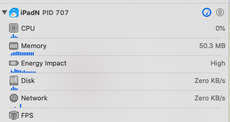
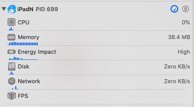

# 如何快速释放图片占用内存

### imageNamed

平常在展示本地图片的时候，习惯使用的方法是 UIImage 的 imageNamed 方法。

这个方法的特点是创建 UIImage 后，并没有进行实际的文件读取和解码，而是要等 UIImage 第一次显示到屏幕上时，解码方法才会被调用，并保存到一个全局缓存当中。在图片解码后，如果只是展示 UIImage 的 UIImageView 被销毁，这部分缓存并不会清空，而是要等到 App 退到后台或收到内存警告的时候，图片的缓存才会清空。

因此该方法比较适用于内存占用较小、会被频繁使用的图片上。

而在有些场景中，比如闪屏页需要展示一张大图，闪屏结束后，这张大图就不需要显示的情况下，imageNamed 就不大适用了。


### contentsOfFile


这时候，就可以尝试使用 UIImage 的 contentsOfFile 方法。这个方法的特点就是当所有展示该图片的控件被销毁后，图片占据的这部分内存马上就被释放，可以有效降低 App 当前的内存值。

需要注意的是，如果把图片文件放在 xcassets 中，是不能使用这个方法的。图片只能放在工程目录下。

使用这个方法，改变  Pad 端闪屏页图片的创建方式，内存由50.3MB下降到 38.4MB，共 减少 12 MB，效果明显。


根据图片占据内存大小的计算公式：

```
内存 = 图片实际高度 * 图片实际宽度 * 一个像素占用字节数(4 Byte)
```


这张图片的像素大小是 2048 × 1536，计算出这张图片的内存大小，2048 * 1536 * 4 Byte = 12582912 Byte = 12MB，正好是内存的减少量。



