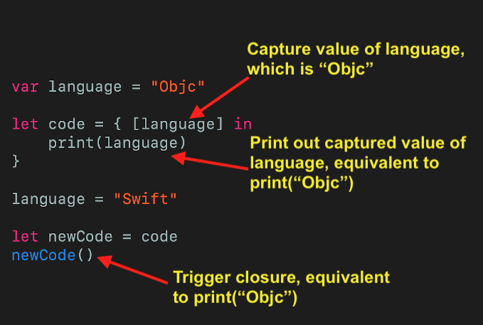
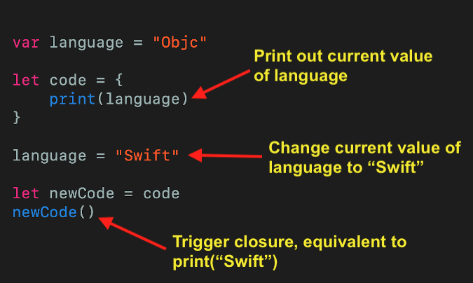
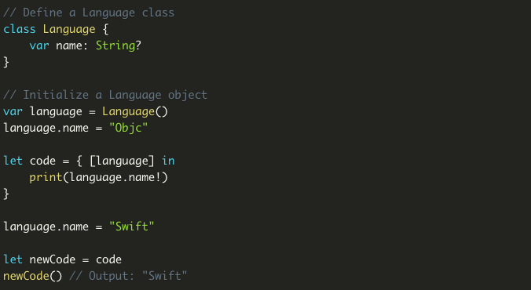
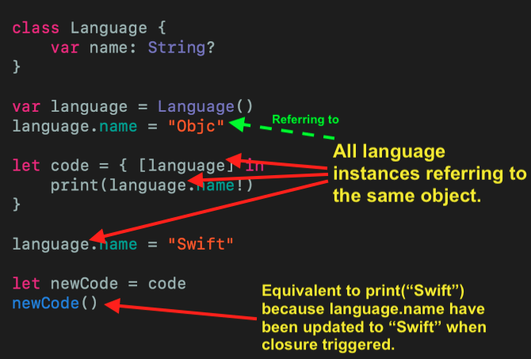

## Capturing Values in Closures

先看一个问题

```swift
var language = "Objc"

let code = { [language] in
    print(language)
}

language = "Swift"

let newCode = code
newCode()

// What's the output?
// 1. Objc
// 2. Swift
// 3. Compiler Error
```

 这段代码会输出什么？

答案是 `Objc` , 因为 language 这个值被捕获了，捕获时值为 Objc




我们可以通过以下代码来验证这个说法



当我们将捕获列表去掉，输出就变成 swift 了，因为闭包里打印的是变量在闭包调用时的值

到目前为止看上去好像问题已经得到解答了，然而这里还有个小细节我们需要注意一下

在 swift 中，值类型和引用类型的区别在于值类型会复制一份数据的拷贝，每个值都是互不影响的，而引用类型会共享一份数据拷贝， 问题中 `language` 是值类型，所以捕获时会复制一份数据拷贝，和源数据没什么关系了，如果把 language 类型改为引用类型，你觉得结果是怎样呢？



这时输出结果就是 swift 了，这里也好理解，因为捕获的 language 和外部定义的 language 是指向的是同一个对象




所以再回到开始的问题，这个问题的完整解释应该是：

Swift 中闭包可以捕获任何常量或变量的值，当被捕获的值是值类型时，会创建一个新的等值实例，当被捕获的值是引用类型时，会捕获那个引用


参考链接：

https://swiftsenpai.com/swift/can-you-answer-this-simple-swift-question-correctly/