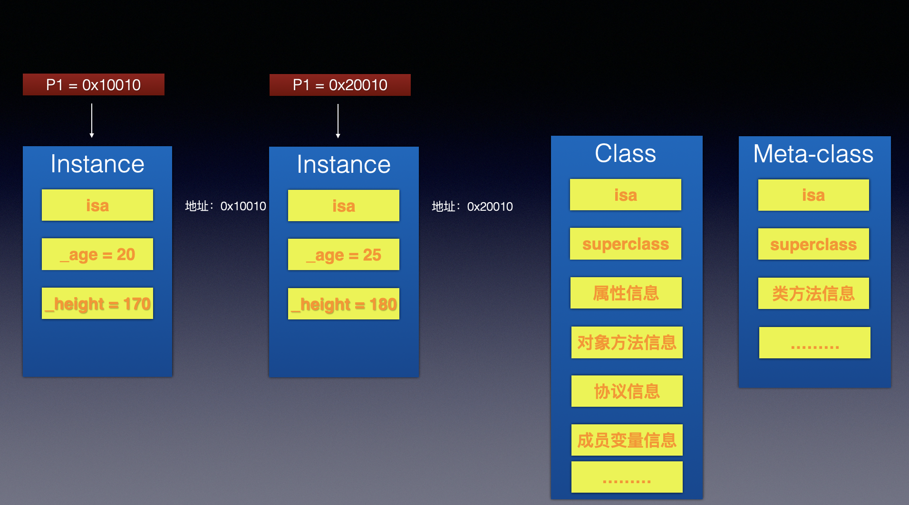

# 实例对象，类对象，元类对象的区别（数据结构）

## 如何获取相应对象

```objective-c
// instance对象，实例对象
NSObject *object1 = [[NSObject alloc] init];
NSObject *object2 = [[NSObject alloc] init];


// class对象，类对象
// class方法返回的一直是class对象，类对象
Class objectClass1 = [object1 class];
Class objectClass2 = [object2 class];
Class objectClass3 = object_getClass(object1);
Class objectClass4 = object_getClass(object2);
Class objectClass5 = [NSObject class];

// meta-class对象，元类对象
// 将类对象当做参数传入，获得元类对象
Class objectMetaClass = object_getClass(objectClass1);


NSLog(@"instance - %p %p",object1，object2);
NSLog(@"class - %p %p %p %p %p",objectClass1,objectClass2,objectClass3,objectClass4,objectClass5);


```

## 区别

- 我们发现实例对象 object1, object2 的指针地址都不一样， 说明在在内存中 object1 和 object2 是分配了完全不同的2块内存
- 我们发现 objectClass1，objectClass2，objectClass3，objectClass4，objectClass5 指针地址都一样，说明类对象在内存的地址具有唯一性，一个类对象只有一份内存
- 我们发现 objectMetaClass 元类对象的指针也存在唯一性， 一个元类对象在内存中只有一份

## 总结

​     我们不难发现 实例对象的 储存的是 私有变量的值 主要包括信息如下 1.isa指针 其他成员变量，而类对象储存的是主要信息包括如下 1.isa 指针， 2.superclass 指针     3. 类的属性信息（@property）4.类的对象方法信息（instance method） 5.类的协议信息（protocol） 6.类的成员变量信息（ivar） 等等   而元类的对象和 类对象 内存则是一样的，但是用途则是不一样，在内存中存储的信息主要包括如下：1.isa指针，2.superclass指针 3.类的类方法信息 （class method）等等 

假设我们定义一个person 类如下

```objective-c
@interface Person : NSObject
{
    int _age;
    int _height;
}
@end
```


