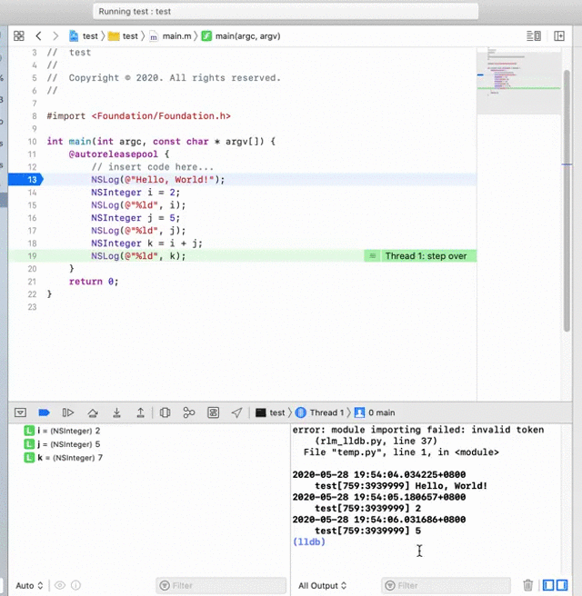

# Xcode 中如何在调试时移动断点指向？

在 Xcode 中调试代码的时候，一般会通过 Step Over，一步一步往下走，查看每一步时候的程序运行情况。有时候点得过快了，错过了自己想要查看的那一行断点。这时候如果重新再来，可能会比较麻烦。最好能提供断点往回走的功能。

## 使用方式

Xcode 为我们提供了这样的功能，操作方式如下图所示：

## 注意点

当然，这实际上会对运行造成一定的影响，比如某个变量会移动后，会保持原先运行所处位置的值，而这个值可能并不是你想要的；另外如果将运行位置移出某一作用域，或者扰乱了程序的实际操作步骤，也可能会造成程序的崩溃。因此需要注意一下。

