# Settings.Bundle

下图是在手机设置里点击钉钉APP后的页面：

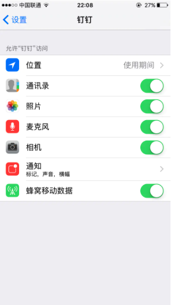


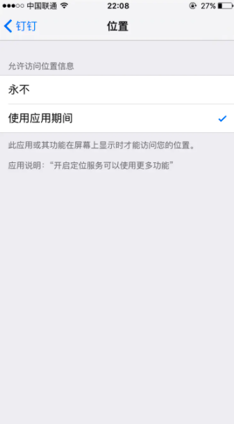


以上，大家肯定再熟悉不过了，那么它是如何实现的呢？没错，就是今天的主角：Settings.Bundle 。

# Settings.Bundle

Settings.Bundle支持六种配置项分别是：**Title，MultiValue，Group，Slider，ToggleSwitch，TextField** 。

## Title

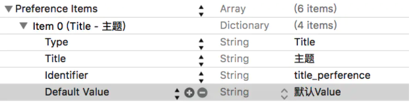

Type：配置类型，默认是Title
 Title：配置项显示的Title
 Identifier: 配置项的标识符，用来获取配置项的配置内容
 Default Value :配置项默认值

## MultiValue

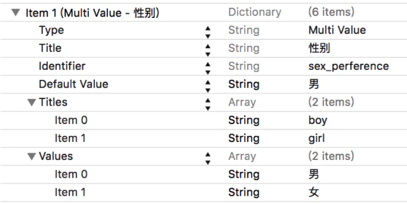

Type：配置类型，默认Multi Value
 Title：配置项显示的标题
 Identifier：配置项标识符，用来获取配置项的配置内容
 Default：配置项默认值
 Titles：显示的标题数组
 Values：显示的值数组，与Titles一一对应

## Group

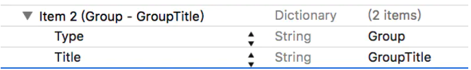

Type，Title 同上；

## TextField

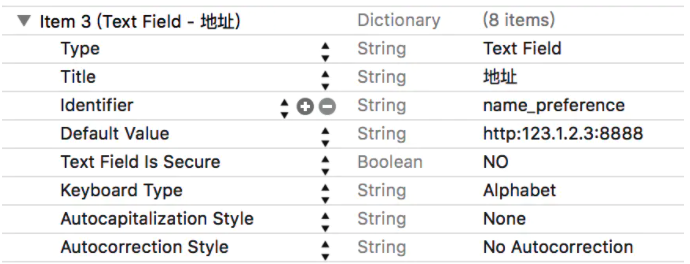

Text Field Is Secure：是否密文显示
 KeyBoard Type：键盘类型
 Autocapitalization Stylele：自动大写
 Autocorrection Style：自动纠正拼写

## ToggleSwitch

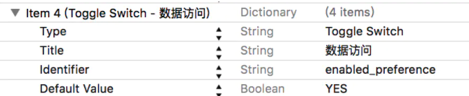

## Slider

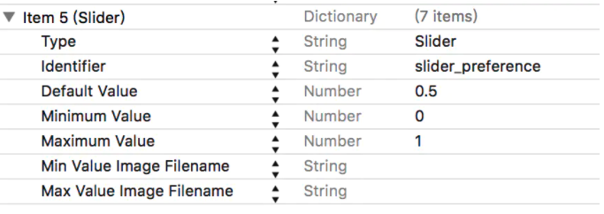

Minimum Value：最小值
 Maximun Value：最大值
 Min Value Image Filename：最小值端图片
 Max Value Image Filename：最大值端图片

# 如何设置

1.New File ->Settings.Bundle

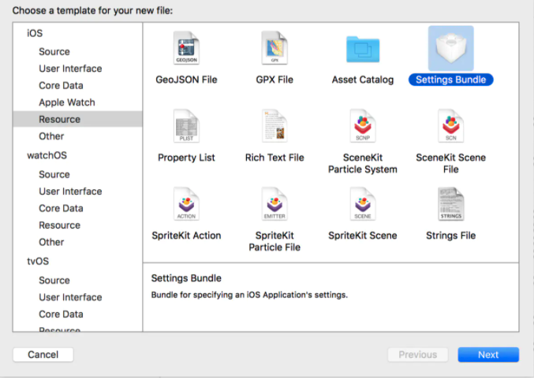

在右侧的目录会看到：

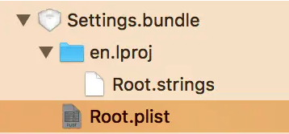

在Root.plist里面添加上面说的配置项目：

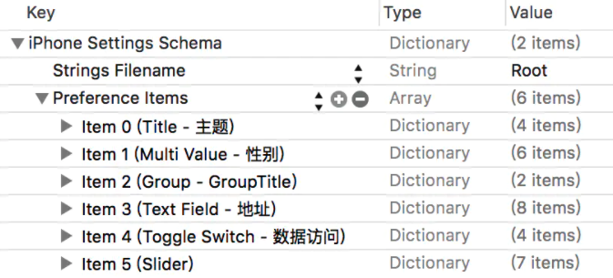

配置好后，运行项目，然后在设置中点击app，效果如下：

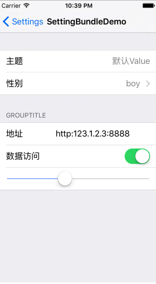

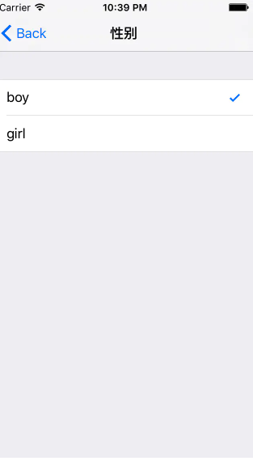


# 程序中获取配置信息

获取配置信息其实很简单，直接上代码：


```objectivec
//获取SettingsBundle信息
    NSUserDefaults *userDefaults = [NSUserDefaults standardUserDefaults];
    
    NSLog(@"%@",[userDefaults objectForKey:@"title_perference"]);
    NSLog(@"%@",[userDefaults objectForKey:@"sex_perference"]);
    NSLog(@"%@",[userDefaults objectForKey:@"name_preference"]);
    NSLog(@"%@",[userDefaults objectForKey:@"enabled_preference"]);
    NSLog(@"%@",[userDefaults objectForKey:@"slider_preference"]);
```

**这里有一点需要说明：**
 如果运行应用后直接直接通过上面的代码获取信息，你会得到null；原因是：
 root.plist实际上只是一个静态文件用来在设置里显示；只有当你对它进行修改，它才会往NSUserDefaults里添加。修改配置后，NSUserDefaults的优先级高于root.plist文件。

# 最后

> 在企业级应用中，后台访问地址需要用户自行配置的时候，SettingsBundle确实很好用。