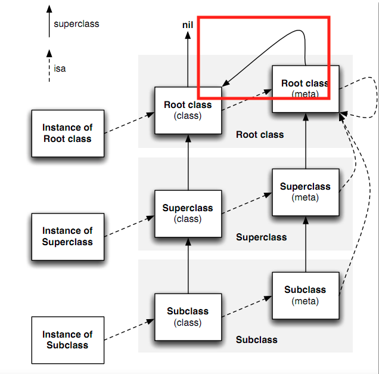

# 类对象什么情况下可以调用对象方法（-方法）

详情见demo：

我们定义 Person 类继承于 NSObject 类  而 NSobjct+Test  类 .h 文件只是声明了 test类方法（+test） 而.m 文件 实现了 test 实例方法（-test）方法，

当我们调用了 如下代码：

[Person test] 

我们发现最终调用的是 NSobject 的 -test 方法

那么为什么 我用Person 类对象调用 +（test）类方法 最后调用到了而是 -（test）方法呢？

总结：

通俗的讲 就是： [Person test]  这句话 底层就是  给Person类发送一条消息即 ---》  objc_msgSend([Person class], @selector(test))  发送消息的时候。 其实底层并不会去 区分 + 方法 和 - 方法 所以当 NSobjct 没有实现 +（test）方法时，自然会调到  -（test）方法

我们可以看以下函数调用图：

我们发现 当 类对象调用类方法的时候 如果在元类对象没有找到 相应的 类方法 底层会通过 superclass 指针去寻找他的父类去寻找 直到逐级找到该类的 基类  如果该类的基类还说没有找到 那么他会通过 superclass指针 （即红框内指针）去 找到该基类的 类对象 有没有 同名的 对象方法 如果有则调用  如果没有则报错 

