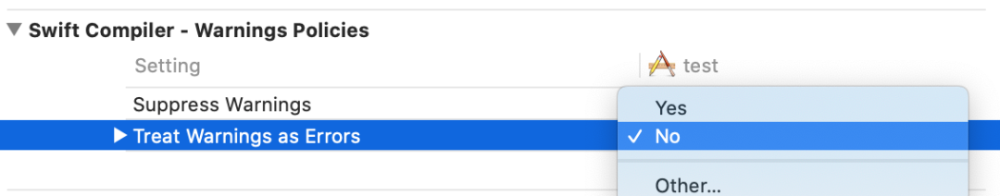
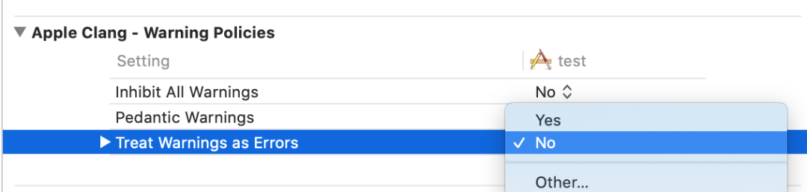
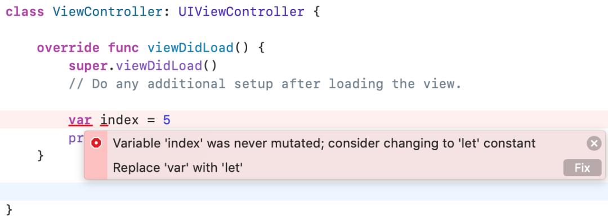

# 如何让工程中的警告当成错误来显示？

在 Xcode 中编辑代码时，总会因为一些原因，让编译器报一些错误或者是警告。通常对于编译错误，我们需要修改以让程序顺序跑起来，而对于警告，很多程序员可能觉得无所谓，只要不影响正常运行，不改也是可以的。而老炮们都知道，这些编译器警告也可能会影响到程序的正常运行。所以，我们也应该重视这些警告，最好是把警告的问题也全部修正。

实际上，Xcode 提供了一个很有用的 build 选项， `Treat Warnings as Errors` ，将这个选项设置为 `YES` ，则编译器会将警告也当成错误来处理，这样可以强制你去修改这些问题。

我们可以在 `Build Settings` 中来设置这个选项。Objective-C 和 Swift 项目稍微有点不同。对于 Objective-C 项目，可以在 `Apple LLVM - Warning Policies` 中设置：

对于 Swift 项目，还可以在 `Swift Compiler - Warning Policies` 中设置：

这样，在编译时，就会将警告当成错误来显示，如下图：

