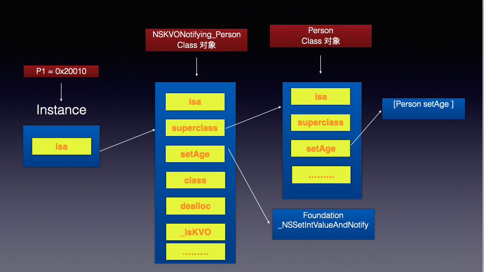

KVO的本质？

我们先来看一个现象

```objective-c
@interface ViewController ()
@property (strong, nonatomic) Person *person1;
@property (strong, nonatomic) Person *person2;
@end
  
@implementation ViewController
NSKeyValueObservingOptions options = NSKeyValueObservingOptionNew | NSKeyValueObservingOptionOld;
[self.person1 addObserver:self forKeyPath:@"age" options:options context:@"123"];

[self.person1 setAge:10];
[self.person2 setAge:20];

@end

@interface Person
  
@end
  
@implementation Person
  
- (void)setAge:(int)age
{
    _age = age;
    
    NSLog(@"setAge:%d", age);
}

@end
  
Output: 
setAge:20
  
```

我们会发现[self.person1 setAge:10] 这句代码并没有调到 Person 的 setAge 方法 

我们打印一下发现

```objective-c
self.person1.isa == NSKVONotifying_Person
self.person2.isa == Person
```

结论: 通过打印我们发现self.person1实例对象的isa 指针 指向的 NSKVONotifying_Person 类对象， 而self.person2实例对象的isa 指针 指向的是 Person 类对象 而 setAge 对象方法是存放在 Person 类对象里面 这就是 为什么[self.person1 setAge:10] 这句代码并没有调到 Person 的 setAge 的原因   而NSKVONotifying_Person 的 setAge 方法 底层是 实现了 _NSSetIntValueAndNotify 这个方法 

我们可以实现一下如下伪代码： 

所以这就是为什么添加KVO 都可以响应  observeValueForKeyPath 这个代理方法的原因所在

疑惑解答： 可以看一下 下图 KVO 内部指针 指向 以及 方法实现  

 NSKVONotifying_Person对象 是在runtime的时候 系统自己创建并不由开发者管理

```objective-c
- (void)setAge:(int)age
{
    _NSSetIntValueAndNotify();
}

// 伪代码
void _NSSetIntValueAndNotify()
{
    [self willChangeValueForKey:@"age"];
    [super setAge:age];
    [self didChangeValueForKey:@"age"];
}

- (void)didChangeValueForKey:(NSString *)key
{
    // 通知监听器，某某属性值发生了改变
    [oberser observeValueForKeyPath:key ofObject:self change:nil context:nil];
}
```


