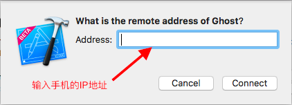

## Xcode实现无线调试

实现真机的无线调试，需要满足三个条件

1. Xcode 9 版本以上
2. iPhone 和 Mac 连接同一个 wifi
3. 至少 iOS 11 的系统

操作步骤如下

1. 如果是第一次无线连接 iPhone，则需要先通过 USB 连接 Mac，然后在 Xcode 中打开 Device 界面
2. 在信息面板中选中 `Connect via network`

3. 拔掉数据线，在左侧如果看到一个网络的标志，则代表连接成功

4. 这时候，点开设备列表，可以看到真机还在，并且右侧有一个小球

5. 如果 iPhone 和 Mac 不在同一个 wifi 下，可以稍微麻烦点，需要使用 IP 连接

存在问题：

因为无线调试，速度相对较慢，有时候会不稳定出现问题。可以根据实际情况进行使用。