### Category的本质

首先我们写一段简单的代码，之后的分析都基于这段代码。

```objectivec
Presen类 
// Presen.h
#import <Foundation/Foundation.h>
@interface Preson : NSObject
{
    int _age;
}
- (void)run;
@end

// Presen.m
#import "Preson.h"
@implementation Preson
- (void)run
{
    NSLog(@"Person - run");
}
@end

Presen扩展1
// Presen+Test.h
#import "Preson.h"
@interface Preson (Test) <NSCopying>
- (void)test;
+ (void)abc;
@property (assign, nonatomic) int age;
- (void)setAge:(int)age;
- (int)age;
@end

// Presen+Test.m
#import "Preson+Test.h"
@implementation Preson (Test)
- (void)test
{
}

+ (void)abc
{
}
- (void)setAge:(int)age
{
}
- (int)age
{
    return 10;
}
@end

Presen分类2
// Preson+Test2.h
#import "Preson.h"
@interface Preson (Test2)
@end

// Preson+Test2.m
#import "Preson+Test2.h"
@implementation Preson (Test2)
- (void)run
{
    NSLog(@"Person (Test2) - run");
}
@end
```

我们之前讲到过实例对象的isa指针指向类对象，类对象的isa指针指向元类对象，当p调用run方法时，通过实例对象的isa指针找到类对象，然后在类对象中查找对象方法，如果没有找到，就通过类对象的superclass指针找到父类对象，接着去寻找run方法。

那么当调用分类的方法时，步骤是否和调用对象方法一样呢？
**分类中的对象方法依然是存储在类对象中的，同本类对象方法在同一个地方，调用步骤也同调用对象方法一样。如果是类方法的话，也同样是存储在元类对象中。**
那么分类方法是如何存储在类对象中的，我们来通过源码看一下分类的底层结构。

### 分类的底层结构

如何验证上述问题？通过查看分类的源码我们可以找到category_t 结构体。


```cpp
struct category_t {
    const char *name;
    classref_t cls;
    struct method_list_t *instanceMethods; // 对象方法
    struct method_list_t *classMethods; // 类方法
    struct protocol_list_t *protocols; // 协议
    struct property_list_t *instanceProperties; // 属性
    // Fields below this point are not always present on disk.
    struct property_list_t *_classProperties;

    method_list_t *methodsForMeta(bool isMeta) {
        if (isMeta) return classMethods;
        else return instanceMethods;
    }

    property_list_t *propertiesForMeta(bool isMeta, struct header_info *hi);
};
```

从源码基本可以看出我们平时使用categroy的方式，对象方法，类方法，协议，和属性都可以找到对应的存储方式。并且我们发现分类结构体中是不存在成员变量的，因此分类中是不允许添加成员变量的。分类中添加的属性并不会帮助我们自动生成成员变量，只会生成get set方法的声明，需要我们自己去实现。

通过源码我们发现，分类的方法，协议，属性等好像确实是存放在categroy结构体里面的，那么他又是如何存储在类对象中的呢？
我们来看一下底层的内部方法探寻其中的原理。
首先我们通过命令行将Preson+Test.m文件转化为c++文件，查看其中的编译过程。


```css
xcrun -sdk iphoneos clang -arch arm64 -rewrite-objc Preson+Test.m
```

在分类转化为c++文件中可以看出_category_t结构体中，存放着类名，对象方法列表，类方法列表，协议列表，以及属性列表。

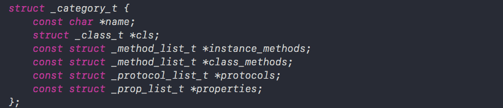

c++文件中category_t结构体

紧接着，我们可以看到_method_list_t类型的结构体，如下图所示

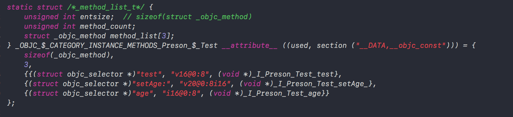

对象方法列表结构体

上图中我们发现这个结构体**`_OBJC_$_CATEGORY_INSTANCE_METHODS_Preson_$_Test`**从名称可以看出是INSTANCE_METHODS对象方法，并且一一对应为上面结构体内赋值。我们可以看到结构体中存储了方法占用的内存，方法数量，以及方法列表。并且从上图中找到分类中我们实现对应的对象方法，test , setAge, age三个方法

接下来我们发现同样的_method_list_t类型的类方法结构体，如下图所示

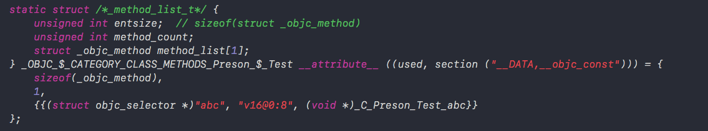

类对象方法列表

同上面对象方法列表一样，这个我们可以看出是类方法列表结构体 `_OBJC_$_CATEGORY_CLASS_METHODS_Preson_$_Test`，同对象方法结构体相同，同样可以看到我们实现的类方法，abc。

接下来是协议方法列表

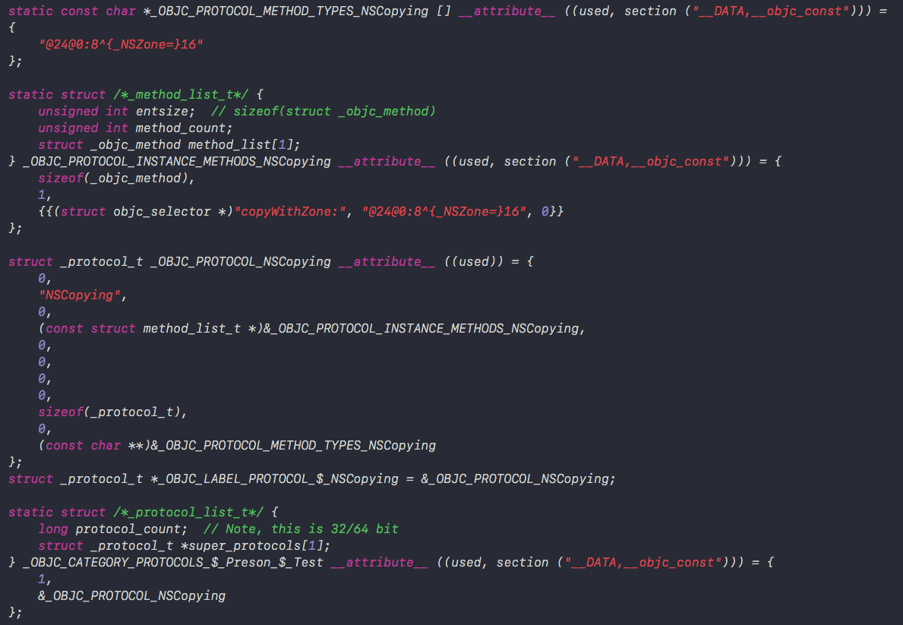

协议方法列表

通过上述源码可以看到先将协议方法通过_method_list_t结构体存储，之后通过_protocol_t结构体存储在**`_OBJC_CATEGORY_PROTOCOLS_$_Preson_$_Test`**中同_protocol_list_t结构体一一对应，分别为protocol_count 协议数量以及存储了协议方法的_protocol_t结构体。

最后我们可以看到属性列表

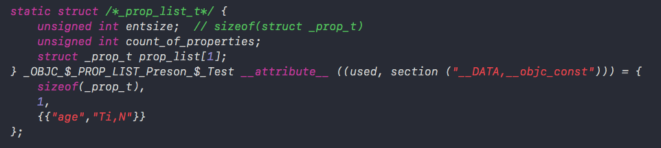

属性列表结构体


属性列表结构体同_prop_list_t结构体对应，存储属性的占用空间，属性属性数量，以及属性列表，从上图中可以看到我们自己写的age属性。

最后我们可以看到定义了**`_OBJC_$_CATEGORY_Preson_$_Test`**结构体，并且将我们上面着重分析的结构体一一赋值，我们通过两张图片对照一下。

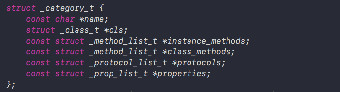

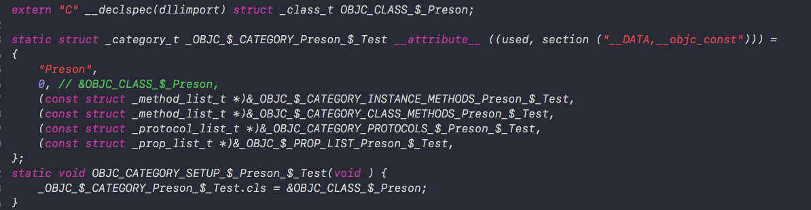

_OBJC_$_CATEGORY_Preson_$_Test

上下两张图一一对应，并且我们看到定义`_class_t`类型的`OBJC_CLASS_$_Preson`结构体，最后将`_OBJC_$_CATEGORY_Preson_$_Test`的`cls`指针指向`OBJC_CLASS_$_Preson`结构体地址。我们这里可以看出，`cls`指针指向的应该是分类的主类类对象的地址。

通过以上分析我们发现。分类源码中确实是将我们定义的对象方法，类方法，属性等都存放在catagory_t结构体中。接下来我们在回到runtime源码查看catagory_t存储的方法，属性，协议等是如何存储在类对象中的。

首先来到runtime初始化函数


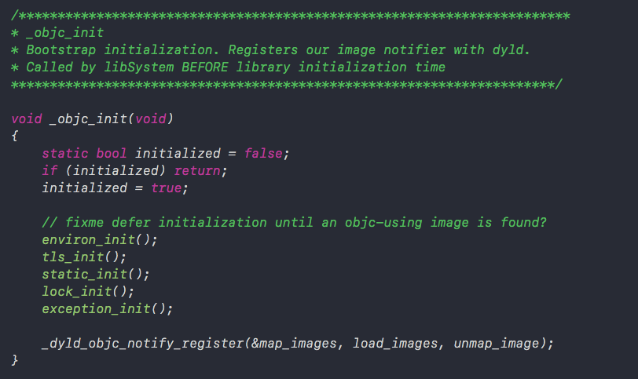

runtime初始化函数

接着我们来到 &map_images读取模块（images这里代表模块），来到map_images_nolock函数中找到_read_images函数，在_read_images函数中我们找到分类相关代码

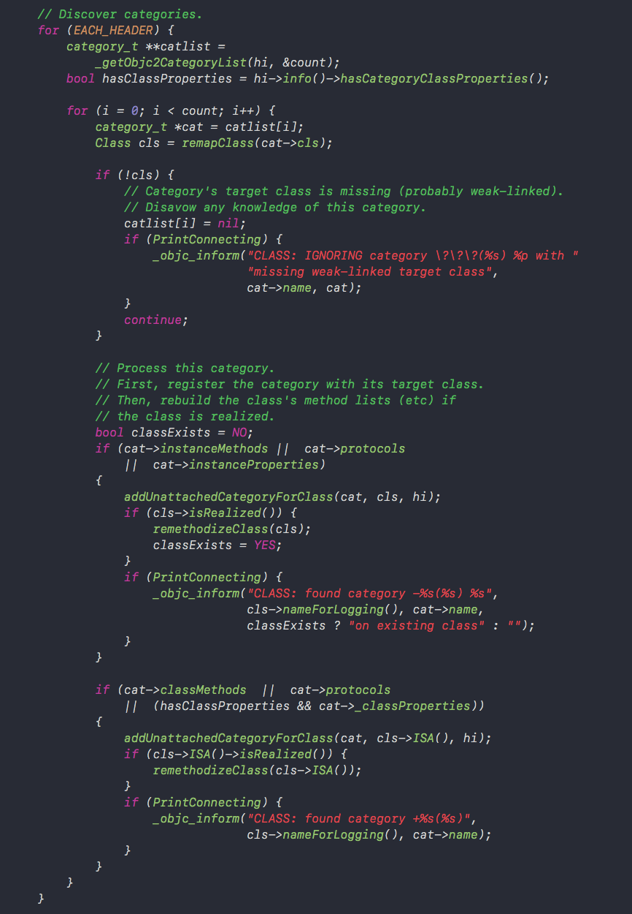

Discover categories代码

从上述代码中我们可以知道这段代码是用来查找有没有分类的。通过_getObjc2CategoryList函数获取到分类列表之后，进行遍历，获取其中的方法，协议，属性等。可以看到最终都调用了remethodizeClass(cls);函数。我们来到remethodizeClass(cls);函数内部查看。

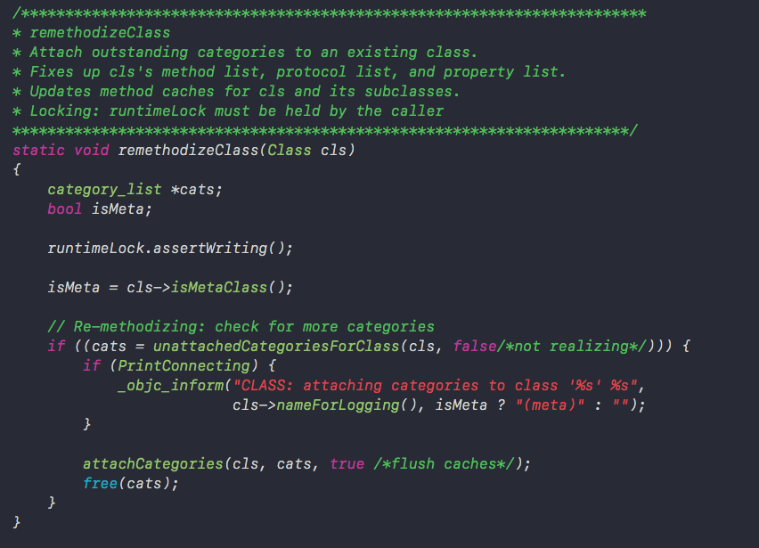

remethodizeClass函数内部


通过上述代码我们发现attachCategories函数接收了类对象cls和分类数组cats，如我们一开始写的代码所示，一个类可以有多个分类。之前我们说到分类信息存储在category_t结构体中，那么多个分类则保存在category_list中。

我们来到attachCategories函数内部。

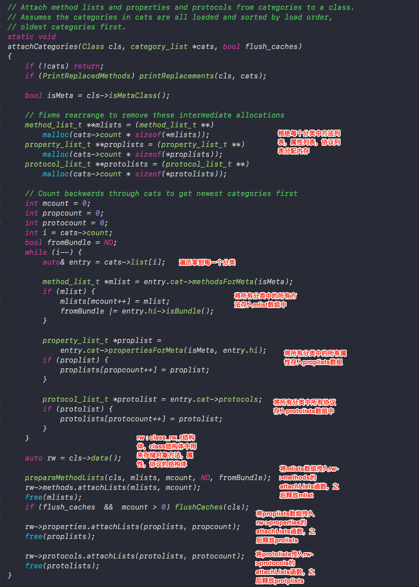

attachCategories函数内部实现

上述源码中可以看出，首先根据方法列表，属性列表，协议列表，malloc分配内存，根据多少个分类以及每一块方法需要多少内存来分配相应的内存地址。之后从分类数组里面往三个数组里面存放分类数组里面存放的分类方法，属性以及协议放入对应mlist、proplists、protolosts数组中，这三个数组放着所有分类的方法，属性和协议。
之后通过类对象的data()方法，拿到类对象的class_rw_t结构体rw，在class结构中我们介绍过，class_rw_t中存放着类对象的方法，属性和协议等数据，rw结构体通过类对象的data方法获取，所以rw里面存放这类对象里面的数据。
之后分别通过rw调用方法列表、属性列表、协议列表的attachList函数，将所有的分类的方法、属性、协议列表数组传进去，我们大致可以猜想到在attachList方法内部将分类和本类相应的对象方法，属性，和协议进行了合并。

我们来看一下attachLists函数内部。

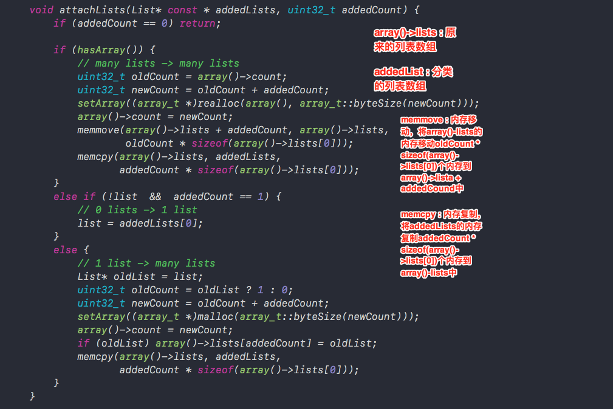

attachLists函数内部实现

**上述源代码中有两个重要的数组**
**array()->lists： 类对象原来的方法列表，属性列表，协议列表。**
**addedLists：传入所有分类的方法列表，属性列表，协议列表。**

attachLists函数中最重要的两个方法为memmove内存移动和memcpy内存拷贝。我们先来分别看一下这两个函数


```cpp
// memmove ：内存移动。
/*  __dst : 移动内存的目的地
*   __src : 被移动的内存首地址
*   __len : 被移动的内存长度
*   将__src的内存移动__len块内存到__dst中
*/
void    *memmove(void *__dst, const void *__src, size_t __len);

// memcpy ：内存拷贝。
/*  __dst : 拷贝内存的拷贝目的地
*   __src : 被拷贝的内存首地址
*   __n : 被移动的内存长度
*   将__src的内存移动__n块内存到__dst中
*/
void    *memcpy(void *__dst, const void *__src, size_t __n);
```

下面我们图示经过memmove和memcpy方法过后的内存变化。


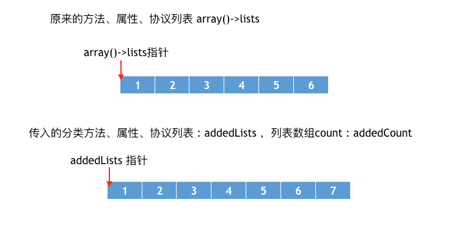

未经过内存移动和拷贝时

经过memmove方法之后，内存变化为


```php
// array()->lists 原来方法、属性、协议列表数组
// addedCount 分类数组长度
// oldCount * sizeof(array()->lists[0]) 原来数组占据的空间
memmove(array()->lists + addedCount, array()->lists, 
                  oldCount * sizeof(array()->lists[0]));
```

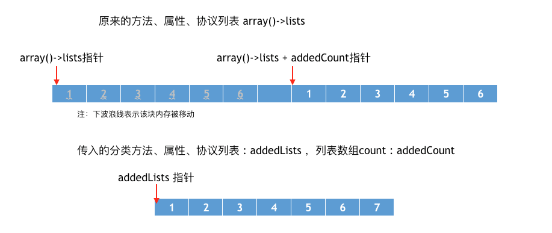

memmove方法之后内存变化

经过memmove方法之后，我们发现，虽然本类的方法，属性，协议列表会分别后移，但是本类的对应数组的指针依然指向原始位置。

memcpy方法之后，内存变化


```cpp
// array()->lists 原来方法、属性、协议列表数组
// addedLists 分类方法、属性、协议列表数组
// addedCount * sizeof(array()->lists[0]) 原来数组占据的空间
memcpy(array()->lists, addedLists, 
               addedCount * sizeof(array()->lists[0]));
```

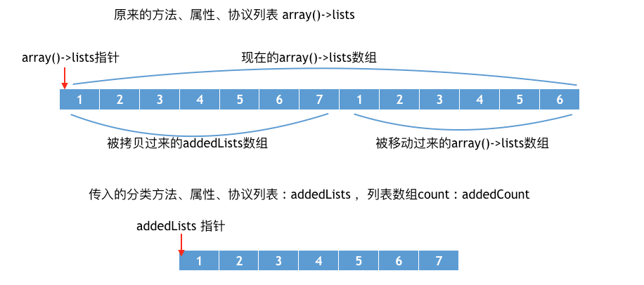

memmove方法之后，内存变化

我们发现原来指针并没有改变，至始至终指向开头的位置。并且经过memmove和memcpy方法之后，分类的方法，属性，协议列表被放在了类对象中原本存储的方法，属性，协议列表前面。

那么为什么要将分类方法的列表追加到本来的对象方法前面呢，这样做的目的是为了保证分类方法优先调用，我们知道当分类重写本类的方法时，会覆盖本类的方法。
其实经过上面的分析我们知道本质上并不是覆盖，而是优先调用。本类的方法依然在内存中的。我们可以通过打印所有类的所有方法名来查看

```objectivec
- (void)printMethodNamesOfClass:(Class)cls
{
    unsigned int count;
    // 获得方法数组
    Method *methodList = class_copyMethodList(cls, &count);
    // 存储方法名
    NSMutableString *methodNames = [NSMutableString string];
    // 遍历所有的方法
    for (int i = 0; i < count; i++) {
        // 获得方法
        Method method = methodList[i];
        // 获得方法名
        NSString *methodName = NSStringFromSelector(method_getName(method));
        // 拼接方法名
        [methodNames appendString:methodName];
        [methodNames appendString:@", "];
    }
    // 释放
    free(methodList);
    // 打印方法名
    NSLog(@"%@ - %@", cls, methodNames);
}
- (void)viewDidLoad {
    [super viewDidLoad];    
    Preson *p = [[Preson alloc] init];
    [p run];
    [self printMethodNamesOfClass:[Preson class]];
}
```

通过打印内容可以发现，调用的是Test2中的run方法，并且Person类中存储着两个run方法。


