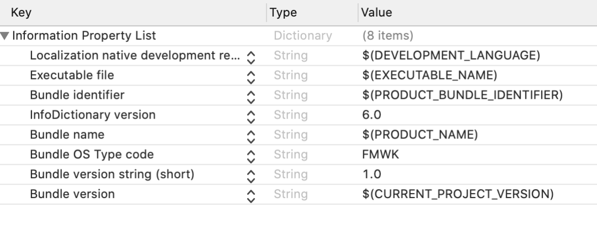

## 如何以源码形式显示 plist 文件

`Info.plist` 文件是 iOS/macOS 应用的基本配置文件，`plist` 是一种结构化的文本文件，使用 Unicode UTF-8 编码，实际上是 XML 文件。

在默认情况下，Xcode 中的 Info.plist 文件在编辑器中如下方式显示：



为了让文件更具可读性，`Info.plist` 中的键都是以可读字符串出现的，而不是实际的键名。有时我们可能需要在代码中，将编程的方式获取属性列表中的某个属性的值，这时我们就需要知道对应的键名。若要显示实际的键名，有两种方式：

• 在编辑器窗口中按住 control 键并单击任意键，在出现的菜单中启用 `Raw Keys & Value`

• 以源文件的形式显示 plist 文件，如下所示：

```
<?xml version="1.0" encoding="UTF-8"?>
<!DOCTYPE plist PUBLIC "-//Apple//DTD PLIST 1.0//EN" "http://www.apple.com/DTDs/PropertyList-1.0.dtd">
<plist version="1.0">
<dict>
    <key>CFBundleDevelopmentRegion</key>
    <string>$(DEVELOPMENT_LANGUAGE)</string>
    <key>CFBundleExecutable</key>
    <string>$(EXECUTABLE_NAME)</string>
    <key>CFBundleIdentifier</key>
    <string>$(PRODUCT_BUNDLE_IDENTIFIER)</string>
    <key>CFBundleInfoDictionaryVersion</key>
    <string>6.0</string>
    <key>CFBundleName</key>
    <string>$(PRODUCT_NAME)</string>
    <key>CFBundlePackageType</key>
    <string>FMWK</string>
    <key>CFBundleShortVersionString</key>
    <string>1.0</string>
    <key>CFBundleVersion</key>
    <string>$(CURRENT_PROJECT_VERSION)</string>
</dict>
</plist>
```


以源码形式展示 plist 文件有两种方式：

• 在 `Project navigator` 中右键点击 plist 文件，在弹出的菜单中选择 `Open As` -> `Source Code`

• 在编辑器中显示 plist 文件，然后点击工具栏上的 `Show or Hide Code Review` 按钮。这个按钮是用于代码审查的，会将编辑器分成左右两个窗口显示更改前后的源代码，在这种情况下，plist 会以源文件的形式展示。

