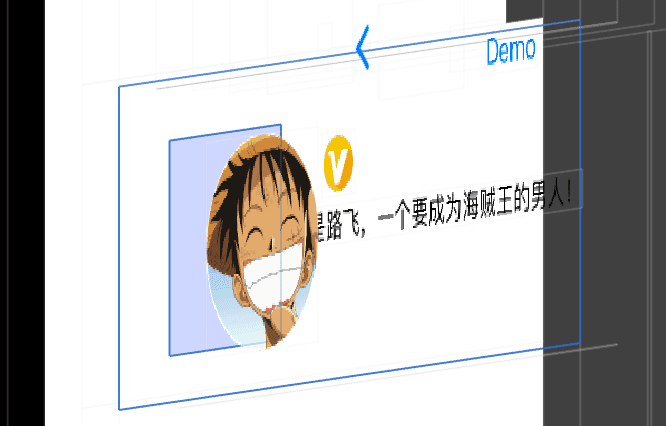

# 如何优雅的减少试图层级

一个视图控件来添加这些小控件。这样有一个副作用就是增加了一层视图层级，如下图所示：

视图层级多了一层，在布局计算时会更加耗时。视图对象多了一个，内存消耗会更多。那有没有办法即保证了控件的封装性，又可以减少一层视图的包裹呢？答案就是它：`UILayoutGuide`，用了它之后的效果如下图：

`UILayoutGuide`是iOS9引入的，就是为了解决需要有占位视图的场景。它不会出现在视图层级里面，也不会有视图对象，只会在布局引擎起作用。下面是官方注释可以细细品味：

> UILayoutGuides will not show up in the view hierarchy, but may be used as items in an NSLayoutConstraint and represent a rectangle in the layout engine.

所以，创建继承`UILayoutGuide`的`LayoutContainer`类，当做子控件的布局容器。子控件只需要相对`LayoutContainer`布局，就可以实现布局独立，达到其封装性。

## 如何使用？

创建布局指南

要创建布局指南，必须执行以下步骤：

实例化新的布局指南。

通过调用视图中添加布局引导到视图

addLayoutGuide 的方法。

使用自动布局定义布局指南的位置和大小。

您可以使用这些指南来定义布局中元素之间的间距。
以下示例显示用于在一系列视图之间定义等间距的布局指南。

```objective-c
UILayoutGuide *space1 = [[UILayoutGuide alloc] init]; 
[self.view addLayoutGuide:space1]; 
UILayoutGuide *space2 = [[UILayoutGuide alloc] init]; 
[self.view addLayoutGuide:space2]; 
[space1.widthAnchor constraintEqualToAnchor:space2.widthAnchor].active = YES;
[self.saveButton.trailingAnchor constraintEqualToAnchor:space1.leadingAnchor].active = YES;
[self.cancelButton.leadingAnchor constraintEqualToAnchor:space1.trailingAnchor].active = YES;
[self.cancelButton.trailingAnchor constraintEqualToAnchor:space2.leadingAnchor].active = YES;
[self.clearButton.leadingAnchor constraintEqualToAnchor:space2.trailingAnchor].active = YES;
```

布局指南也可以作为一个黑盒子，包含许多其他视图和控件。这允许您封装视图的一部分，将布局打破为模块化块。

```objective-c
UILayoutGuide *container = [[UILayoutGuide alloc] init]; 
[self.view addLayoutGuide:container]; // 布局容器的内容 
[self.label.lastBaselineAnchor constraintEqualToAnchor:self.textField.lastBaselineAnchor].active = YES; [self.label.leadingAnchor constraintEqualToAnchor:container.leadingAnchor].active = YES; 
[self.textField.leadingAnchor constraintEqualToAnchor:self.label.trailingAnchor constant:8.0].active = YES;
[self.textField.trailingAnchor constraintEqualToAnchor:container.trailingAnchor].active = YES; [self.textField.topAnchor constraintEqualToAnchor:container.topAnchor].active = YES; [self.textField.bottomAnchor constraintEqualToAnchor:container.bottomAnchor].active = YES; // 设置外部约束。 
UILayoutGuide *margins = self.view.layoutMarginsGuide; 
[container.leadingAnchor constraintEqualToAnchor:margins.leadingAnchor].active = YES; [container.trailingAnchor constraintEqualToAnchor:margins.trailingAnchor].active = YES; 
[container.topAncor constraintEqualToAnchor:self.topLayoutGuide.bottomAnchor constant:20.0].active = YES;

```

