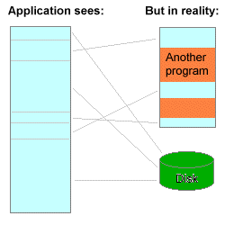

## 什么是虚拟内存

CPU 访问内存的方式，最简单最直接的方式，就是 CPU 直接通过物理地址去访问对应的内存，这样也被叫做物理寻址。其中存在最严重的问题之一就是地址空间缺乏保护。简单来说，因为直接暴露的是物理地址，所以进程可以访问到任何物理地址，用户进程想干嘛就干嘛，这是非常危险的。

现代处理器使用的是虚拟寻址的方式，CPU 通过访问虚拟地址（Virtual Address），经过翻译获得物理地址，才能访问内存。这个翻译过程由 CPU 中的内存管理单元（Memory Management Unit，缩写为 MMU）完成。

刚才提到，直接使用物理寻址，会有地址空间缺乏保护的严重问题。那么如何解决呢？实际上在使用了虚拟寻址之后，由于每次都会进行一个翻译过程，所以可以在翻译中增加一些额外的权限判定，对地址空间进行保护。所以，对于每个进程来说，操作系统可以为其提供一个独立的、私有的、连续的地址空间，这就是所谓的**虚拟内存**。

虚拟内存最大的意义就是保护了进程的地址空间，使得进程之间不能够越权进行互相地干扰。对于每个进程来说，操作系统通过虚拟内存进行"欺骗"，进程只能够操作被分配的虚拟内存的部分。与此同时，进程可见的虚拟内存是一个连续的地址空间，这样也方便了程序员对内存进行管理。

对于进程来说，它的可见部分只有分配给它的虚拟内存，而虚拟内存实际上可能映射到物理内存以及硬盘的任何区域。由于硬盘读写速度并不如内存快，所以操作系统会优先使用物理内存空间，但是当物理内存空间不够时，就会将部分内存数据交换到硬盘上去存储，这就是所谓的 Swap 内存交换机制。有了内存交换机制以后，相比起物理寻址，虚拟内存实际上利用硬盘空间拓展了内存空间。

总结一下，虚拟内存带来的好处：

1. 保护了每个进程的地址空间
2. 简化了内存管理
3. 利用硬盘空间拓展了内存空间。

