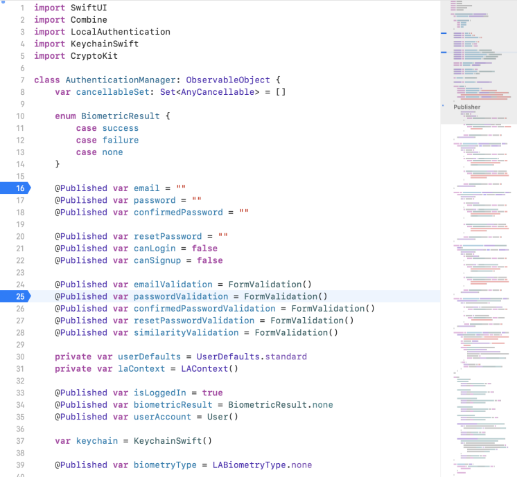
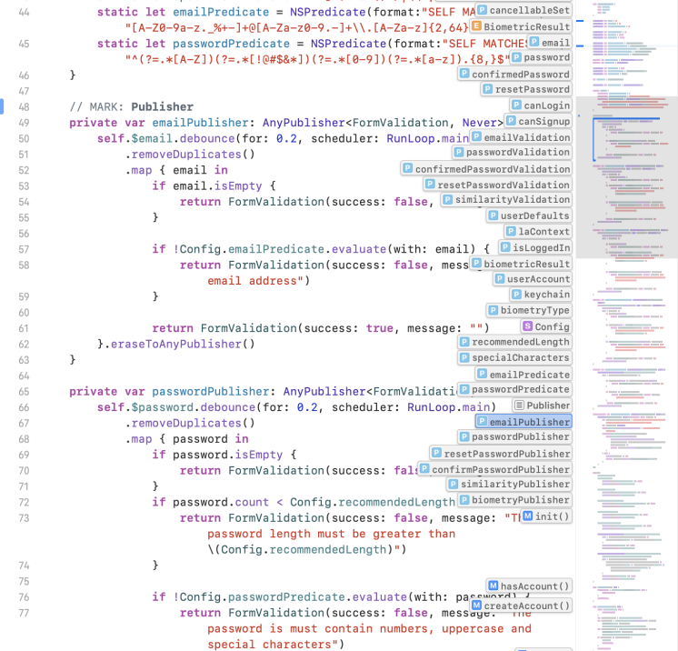
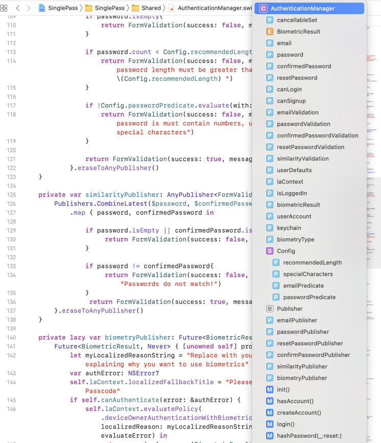

## Xcode minimap

Xcode 在 11 中引入了 minimap 功能，这个超实用的功能可以说是现代 IDE 的标配，向我们展示了代码的全景，可以让我们更好地浏览代码。如果仔细观察，会发现 minimap 中的配色和语法高亮与编辑区的是一样的。代码中的变更(Git)、断点、甚至是当前光标位置也是一样的。我们可以在 minimap 中概览代码中的所有信息。

当我们将鼠标悬停在 minimap 上，移动鼠标时，可以发现鼠标当前位置的属性、函数、类会显示在 minimap 的左侧。单击悬停位置时，编辑区会移动至该位置对应的代码，这可以方便我们快速浏览代码。

还有一个非常棒的功能：当鼠标悬停在 minimap 上时，按住 command 键会显示当前文件所有的类、函数、属性、类型等信息的一个列表，这个列表还包含了 `// MARK:` 的信息。这时可以点击任意一个列表项，以跳转到代码对应的部分。

这个列表与编辑区顶部的文件导航中弹出的文件信息列表的信息是一致的。

