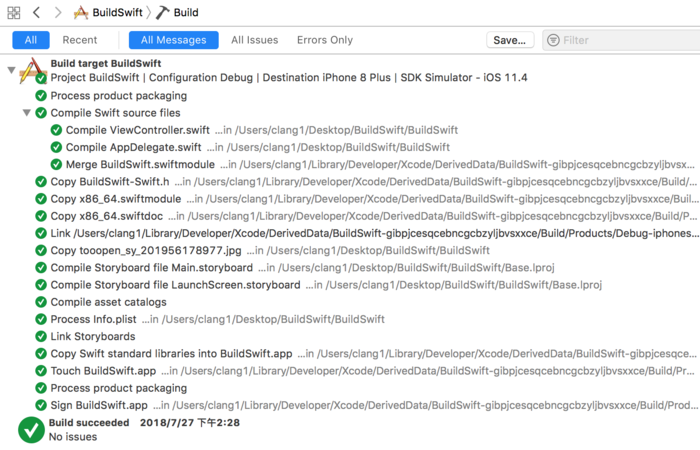

## iOS App 编译过程

   我分别用OC和Swift语言创建两个Demo，通过BulidLog看一下整个编译过程：

​                       

根据图中和参考的文章总结一下 iOS 项目编译过程：

1. 写入辅助文件：将项目的文件结构对应表、将要执行的脚本、项目依赖库的文件结构对应表写成文件，方便后面使用；
2. 创建App架构：为填充后面步骤编译得到的文件等；
3. 运行预设脚本：Cocoapods 会预设一些脚本，当然你也可以自己预设一些脚本来运行。这些脚本都在 Build Phases 中可以看到；
4. 编译.m文件:这个过程是由LLVM完成的，编译成一个可执行文件(Mach-0)；
5. 链接编译后得到的文件；
6. 拷贝项目中的资源，比如 图片资源；
7. 编译 storyboard
8. 编译 asset文件：图片如果使用 Assets.xcassets 来管理图片，那么这些图片将会被编译成机器码，除了 icon 和 launchImage；
9. 处理info.plist ；
10. 执行CocoaPod脚本；
11. 拷贝swift标准包；
12. 构建.app并签名；
13. 完成打包。

### 什么是LLVM

> The LLVM Project is a collection of modular and reusable compiler and toolchain technologies. Despite its name, LLVM has little to do with traditional virtual machines. The name "LLVM" itself is not an acronym; it is the full name of the project.
> LLVM项目是模块化、可重用的编译器和工具链技术的集合。尽管名为LLVM，但它与传统的虚拟机几乎没有关系。“LLVM”这个名字本身并不是首字母缩略词;这是项目的全称。

LLVM在编译过程中分为了三个模块: 前端、中间优化器和后端 
LLVM各个模块的作用：

- 前端：对目标语言代码进行语法分析，语义分析，生成中间代码。在这个过程中，会进行类型检查，如果发现错误或者警告会标注出来在哪一行；
- 中间优化器：对中间代码进行优化，去除冗余代码，这个过程会进行BitCode的生成，链接期优化等；
- 后端：先进行与机器无关的代码优化，生成汇编语言，在生成汇编语言之后会再进次进行与机器相关的代码优化，最后将各个文件的机器代码链接。

在iOS中，OC和Swift两种语言的编译在前端是有差别的:OC中使用的编译器前端为:[Clang](http://clang.llvm.org/),在Swift中使用的编译器前端为swift自己编写的，这个我们可以在BuildLog里面具体看到。

