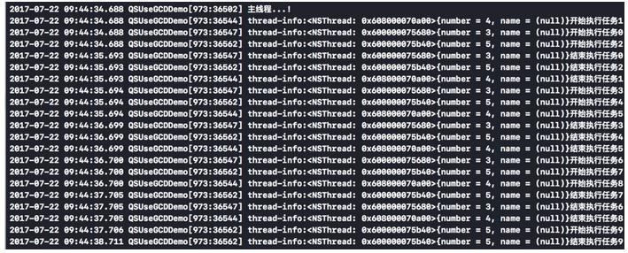

## iOS下如何实现指定线程数目的线程池？

### 1、GCD的信号量机制（dispatch_semaphore）

- 信号量是一个整型值，有初始计数值；可以接收通知信号和等待信号。当信号量收到通知信号时，计数+1；当信号量收到等待信号时，计数-1；如果信号量为0，线程会阻塞，直到线程信号量大于0，才会继续下去。

- 使用信号量机制可以实现线程的同步，也可以控制最大并发数。以下是控制最大并发数的代码。

- ```objective-c
  dispatch_queue_t workConcurrentQueue = dispatch_queue_create("cccccccc", DISPATCH_QUEUE_CONCURRENT);
  dispatch_queue_t serialQueue = dispatch_queue_create("sssssssss",DISPATCH_QUEUE_SERIAL);
  dispatch_semaphore_t semaphore = dispatch_semaphore_create(3);
  for (NSInteger i = 0; i < 10; i++) {
  dispatch_async(serialQueue, ^{
  dispatch_semaphore_wait(semaphore, DISPATCH_TIME_FOREVER);
  dispatch_async(workConcurrentQueue, ^{
      NSLog(@"thread-info:%@开始执行任务%d",[NSThread currentThread],(int)i);
      sleep(1);
      NSLog(@"thread-info:%@结束执行任务%d",[NSThread currentThread],(int)i);
      dispatch_semaphore_signal(semaphore);});
  });
  }
  NSLog(@"主线程...!");
  ```

  执行结果如下

  

说明：从执行结果中可以看出，虽然将10个任务都异步加入了并发队列，但信号量机制控制了最大线程并发数，始终是3个线程在执行任务。此外，这些线程也没有阻塞线程。
