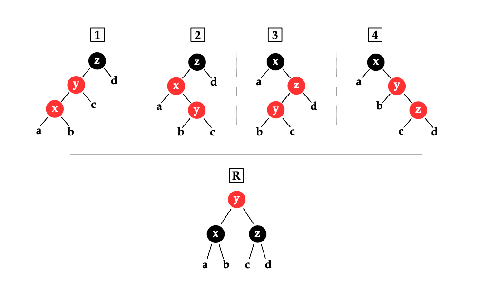

# 字典

在 iOS 开发中使用的字典是非有序的，不管是 NSDictionary 还是 Swift 的 Dictionary。这跟他们的实现原理有关，但也有一种实现可以做到有序的字典。

## 无序字典
无序字典一般用散列表(hash map)实现。


散列表会用一个数组来做存储，用 hash 函数计算 key 的 hash 值，计算数组的索引，插入到数组中。

图中是用分离链接法来解决 hash 值冲突的问题，同样的 key 会分配到一个链表中。在数组容量不够时，散列表也会进行动态扩容。

可以很容易看出，散列表的键值对在插入时就是无序的 。

## 有序字典

有序字典会用红黑树来实现，红黑树算一种二叉平衡搜索树。

### 二叉搜索树
二叉搜索树(Binary serach tree) 是这样的结构，


左节点的值小于根节点，右节点的值大于根节点，符合递归定义。

我们定义这样一颗二叉搜索树
```swift
public enum BinaryTree<Element: Comparable> {
    case empty
    indirect case node(Element, BinaryTree, BinaryTree)
}

```

通过中序遍历，可以按照顺序打印所有元素。
```swift
public extension BinaryTree {
    func forEach(_ body: (Element) -> Void) {
        switch self {
        case .empty:
            break
        case let .node(value, left, right):
            left.forEach(body)
            body(value)
            right.forEach(body)
        }
    }
}
```

### 平衡树
平衡的意思是尽可能降低树的高度，降低访问的时间复杂度。因为理想的二叉搜索树的访问时间复杂度在 O(log n)，在最坏的情况，可以达到 O(n)。


比如，我们不做任何平衡，直接向二叉搜索树插入节点。

```swift
func testBST() throws {
	let array = Array(2...10)
	
	var bst = BinaryTree.node(1, .empty, .empty)
	
	array.forEach {
		bst.insert($0)
	}
	
	print(bst)
}
```

会构造出接近链表的数据结构，而不是树了。

```
                               ┌───10
                            ┌───9
                            │   └───•
                        ┌───8
                        │   └───•
                    ┌───7
                    │   └───•
                ┌───6
                │   └───•
            ┌───5
            │   └───•
        ┌───4
        │   └───•
    ┌───3
    │   └───•
┌───2
│   └───•
1
└───•
```

我们需要大概这样的树:

```
    ┌───9
┌───8
│   │   ┌───7
│   └───6
│       └───•
5
│       ┌───4
│   ┌───3
│   │   └───•
└───2
    └───1
```

所以说平衡是非常关键的，O(log n) 于 O(n) 的复杂度相比差距很大。


### 红黑树

红黑树是平衡树的一种，也是二叉搜索树。


红黑树的节点会多一位信息保存颜色，黑色或红色。它有以下性质:

	1. 根节点是黑色的。
	2. 红色节点只拥有黑色的子节点。(只要有，就一定是。)
	3. 从根节点到一个空位，树中存在的每一条路径都包含相同数量的黑色节点。


> 性质2导致了路径不能有两个毗连的红色节点。最短的可能路径都是黑色节点，最长的可能路径有交替的红色和黑色节点
> 因为根据性质3所有路径都有相同数目的黑色节点，这就表明了没有路径能多于任何其他路径的两倍长。

所以红黑树大致上是平衡的

#### 访问

定义红黑树

```swift
public enum RedBlackTree<Element: Comparable> {
    case empty
    indirect case node(Color, Element, RedBlackTree, RedBlackTree)
}
```

可以通过中序遍历，从最小值到最大值按顺序访问树中的元素
```swift
public extension RedBlackTree {
    func forEach(_ body: (Element) throws -> Void) rethrows {
        switch self {
        case .empty:
            break
        case let .node(_, value, left, right):
            try left.forEach(body)
            try body(value)
            try right.forEach(body)
        }
    }
}
```

#### 平衡
插入一个元素之后，一个红色节点拥有红色子节点的四种可能的情况。
x、y 和 z 代表值，而 a、b、c 和 d 是 (可能为 的) 子树。如果树与 1-4 的模式相匹配，则它的节点需要按照模式 R 重组



```swift
extension RedBlackTree {
    func _inserting(_ element: Element) -> (tree: RedBlackTree, old: Element?) {
        switch self {

        case .empty:
            return (.node(.red, element, .empty, .empty), nil)

        case let .node(_, value, _, _) where value == element:
            return (self, value)

        case let .node(color, value, left, right) where value > element:
            let (l, old) = left._inserting(element)
            if let old = old { return (self, old) }
            return (balanced(color, value, l, right), nil)

        case let .node(color, value, left, right):
            let (r, old) = right._inserting(element)
            if let old = old { return (self, old) }
            return (balanced(color, value, left, r), nil)
        }
    }
}

/// 四个 case 对应四种情况
/// 返回重组后的子树
extension RedBlackTree {
    func balanced(_ color: Color, _ value: Element, _ left: RedBlackTree, _ right: RedBlackTree) -> RedBlackTree {
        switch (color, value, left, right) {
        case let (.black, z, .node(.red, y, .node(.red, x, a, b), c), d),
             let (.black, z, .node(.red, x, a, .node(.red, y, b, c)), d),
             let (.black, x, a, .node(.red, z, .node(.red, y, b, c), d)),
             let (.black, x, a, .node(.red, y, b, .node(.red, z, c, d))):
            return .node(.red, y, .node(.black, x, a, b), .node(.black, z, c, d))
        default:
            return .node(color, value, left, right)
        }
    }
}
```

测试

```swift
func testRedBlackTreeInsert() throws {
    var set = RedBlackTree<Int>.empty

    for i in (1 ... 10).shuffled() {
        set.insert(i)
    }

    print(set)
}
```

```
        ┌───•
    ┌───■ 10
    │   └───□ 9
┌───■ 8
│   │   ┌───•
│   └───■ 7
│       └───□ 6
■ 5
│       ┌───□ 4
│   ┌───■ 3
│   │   └───•
└───■ 2
    └───■ 1
```

# 参考
- [集合类型优化](https://objccn.io/products/optimizing-collections/)
