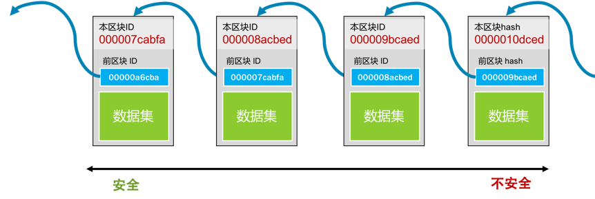

## 什么是区块链？

区块链又叫 blockchain，其中有一个一个的区块，每个区块中包括着一组交易信息，然后，每一个区块都会有一个 ID（或是一个地址），这些区块通过记录前一个区块的 ID 来形成一条链。如下图：

其中注意的点包括：

1. 每个块的 ID 都是通过其内容生成的，所以，只要是内容有一丁点儿的变化，这个 ID 都会完全不一样。
2. 而生成 ID 的内容中还包括上一个块的 ID。于是只要上一个块的内容变了，其 ID 也要跟着变（不然就不合法了），那么后面指向这个块的 ID 也要变。于是，后面指向这个块的 ID 也要重新计算，而变成另一个，这样就会形成一个连锁效应——一个块被修改，后续的所有块都要跟着一起改。于是导致了修改成本的提升。
3. 这种一处改，处处改的方式，并不代表不能篡改，而只是让修改面比较大，让你的改动麻烦一点。
4. 越旧的区块的篡改会造成越大面积的修改，于是越旧的区块就不容易篡改，就越安全。反之，越新的区块就越不安全。

