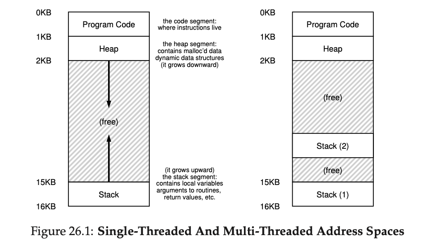
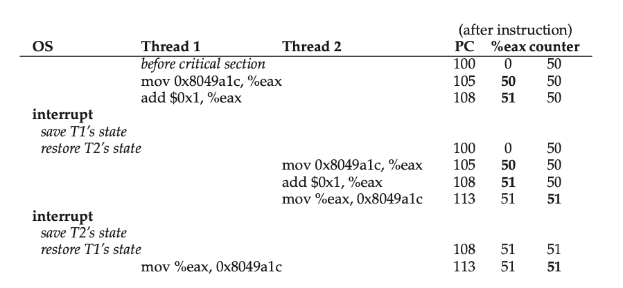

# 自定义锁

## 线程原理
在实现锁之前，需要知道为什么需要锁。单线程情况下是不需要锁的，多线程情况下需要。

先看看线程在进程中是怎么表示的。



图中右侧是多线程情况下的内存，每个线程有自己的 stack 空间，有一个专用术语 thread-local storage

线程有如下特性：

    1. 与进程共享 address space（地址空间），所以可以访问一样的数据
    2. 有自己的 pc（程序计数器），来追踪从哪里获取指令
    3. 有自己的一套私有寄存器
    4. 切换线程的时候，会发生 context switch，一个线程的寄存器状态会被保存，另一个线程的寄存器状态会恢复。保存在 thread control blocks (TCBs) 中
    
### 共享变量问题

开启两个线程，累加同一个变量 `count`

```objc
static volatile int count = 0;

@interface ViewController ()
@property (nonatomic) NSThread *thread1;
@property (nonatomic) NSThread *thread2;
@end


- (void)viewDidLoad {
    [super viewDidLoad];

    self.thread1 = [[NSThread alloc] initWithTarget:self selector:@selector(threadStart:) object:@1];
    self.thread2 = [[NSThread alloc] initWithTarget:self selector:@selector(threadStart:) object:@2];
    
    [self.thread1 start];
    [self.thread2 start];
}

- (void)test {
    for (int i = 0; i < 1e7; i++) {
        count += 1;
    }
}

- (void)threadStart:(NSNumber *)sender {
    NSLog(@"thread_%@, count: %d start", sender, count);
    
    [self test];
    
    NSLog(@"thread_%@, count: %d end", sender, count);
}

```

执行结果：
```
2020-09-22 14:11:50.090898+0800 lockTest[21431:748433] thread_1, count: 0 start
2020-09-22 14:11:50.090903+0800 lockTest[21431:748434] thread_2, count: 0 start
2020-09-22 14:11:50.155675+0800 lockTest[21431:748434] thread_2, count: 11093555 end
2020-09-22 14:11:50.155950+0800 lockTest[21431:748433] thread_1, count: 11299262 end
```
可以看到，最终结果并不是 2e7，说明多线程访问共享变量出现了问题。

### 共享变量问题分析

```c
count += 1;
```
编译到汇编后，大概是这样三条指令

```asm
mov 0x8049a1c, %eax     ; 读取 count 变量地址 0x8049a1c 的值到寄存器 %eax
add $0x1, %eax          ; %eax += 1
mov %eax, 0x8049a1c     ; 把 %eax 的值存放到 0x8049a1c 地址中
```

一种执行情况分析：


count 初始值是 50

`interrupt` 后会发生线程切换，由操作系统调度，会保存一个线程的状态，恢复另一个线程的状态。

1. thread1 执行下面指令后，会读取 count 的值，保存到 %eax 中并加1。
```asm
mov 0x8049a1c, %eax 
add $0x1, %eax
```
2. 发生 interrupt，切换到 thread2。PC 变成了 100，%eax 恢复到 0，因为用的是 thread2 的PC和寄存器。

3. thread2 执行下面这些指令

```asm
mov 0x8049a1c, %eax
add $0x1, %eax
mov %eax, 0x8049a1c
```

4. 发生 interrupt，切换到 thread1

thread1 继续执行，恢复 PC 到 108，%eax 到 51

5. thread1 执行下面指令

```asm
mov %eax, 0x8049a1c ; 把 51 保存到了 count
```

结果是，两个线程执行了两遍 count += 1，但只加了一次。根本原因是线程有自己的寄存器，会保存变量的副本。
如果在执行上述三条指令中发生了线程切换，那么很有可能，共享变量的值会被某条线程中保存的值覆盖。

我们希望的是，访问这个变量的时候，不希望其他线程来访问。或者说执行这三条指令的时候，不希望被打断。

在硬件上，其实有类似这样的原子指令，可以用来实现锁。

## 旋转锁

```objc
typedef struct __lock_t {
    int64_t flag;
} lock_t;

void init(lock_t *lock) {
    // 0 意味着锁是可用的，1 是锁被持有
    lock->flag = 0;
}

void lock(lock_t *lock) {
    /// 比较第一个和第三个参数，如果相等，设置第二个参数到第三个参数
    /// 如果第一个参数等于第三个参数，返回 YES。否则返回 NO
    while (!OSAtomicCompareAndSwap64(0, 1, &lock->flag))
        ;
}

void unlock(lock_t *lock) {
    lock->flag = 0;
}
```

`lock` 函数，内建一个 while 循环，判断 lock 是否被持有，如果没有持有，直接跳出循环并设置为持有 lock->flag = 1，否则一直循环判断。

这里的判断并设置值的操作也会有多线程访问的问题，但 `OSAtomicCompareAndSwap64()` 能保证这里的操作是原子性的，意味着在 CPU 层面能够保证这些指令被一次性执行完，不会被系统中断干扰。

