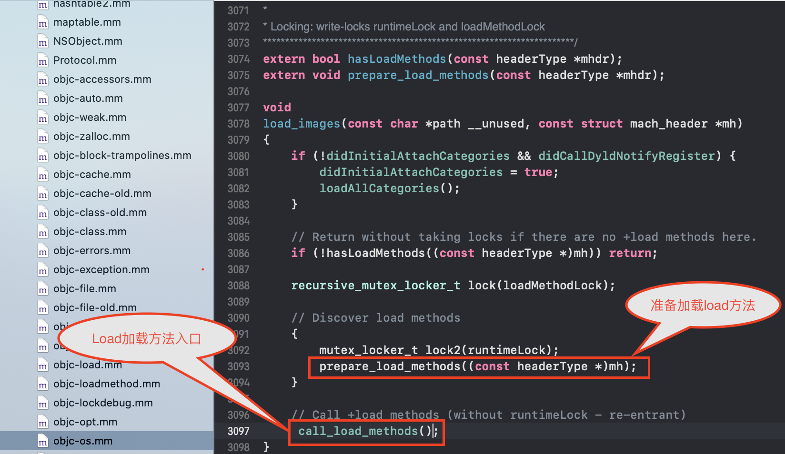
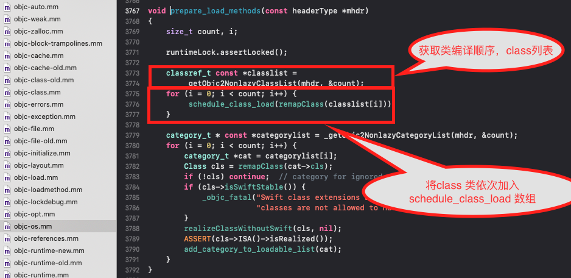
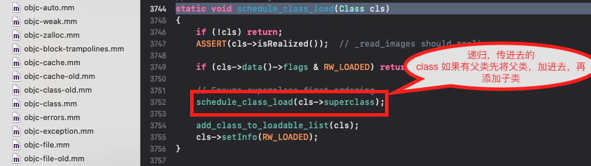
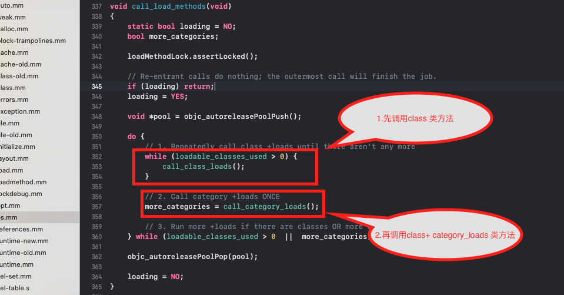

## Load 方法的调用顺序

总结：load 方法调用顺序如下：

1. 先调用 class的 +load方法 再调用class_category  +load 方法

2. class +load的方法调用 先编译先调用 如果该类有父类 父类先调用 在调用子类
3. class_category  +load方法遵循先 编译先调用原则
4. 所有class 和class_category +load方法都只调用一次 即在runtime 加载类和分类的时候调用