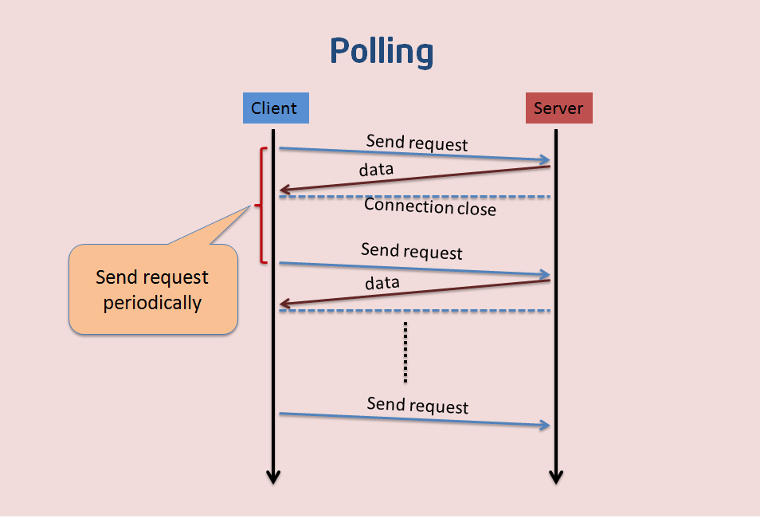
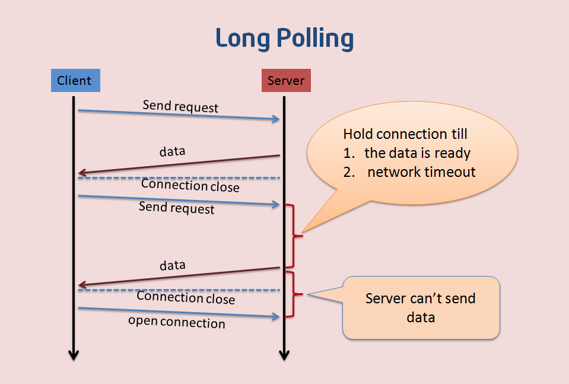
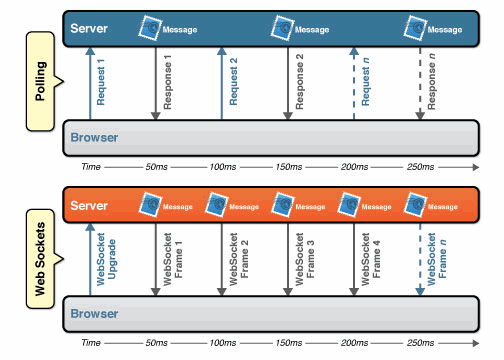
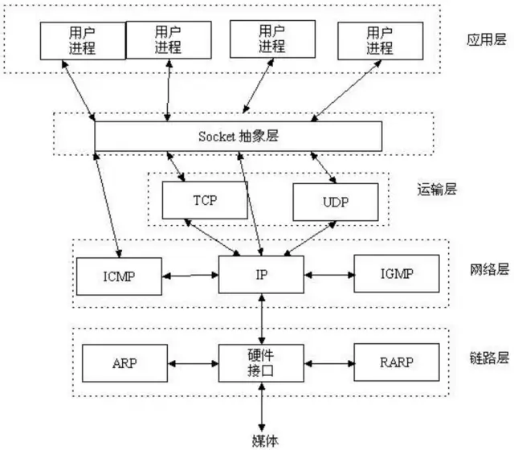

## 0145 WebSocket和Socket的区别

### 实时信息获取的应用场景

需要获取实时信息的一些应用场景：

1. IM 聊天
2. 弹幕
3. 协同编辑（比如石墨）
4. 股票基金实时报价
5. 体育赛果更新

### 为什么会有 WebSocket？

在 WebSocket 出现之前，如何获取实时信息呢？

1. 轮询的方式，具体操作是客户端每隔一段时间会向服务端通过 HTTP 请求的方式询问一次，是否有新消息。这样子的问题是每次发送请求都需要携带 HTTP 报文，HTTP 报文中的 Header 数据量较大，比较浪费。此外定期询问也会在空闲时段造成浪费

2. 长轮询：长轮询是对轮询的改进版，客户端发送HTTP给服务器之后，有没有新消息，如果没有新消息，就一直等待。当有新消息的时候，才会返回给客户端。在某种程度上减小了网络带宽和CPU利用率等问题。但是这种方式还是有一种弊端：例如假设服务器端的数据更新速度很快，服务器在传送一个数据包给客户端后必须等待客户端的下一个Get请求到来，才能传递第二个更新的数据包给客户端，那么这样的话，客户端显示实时数据最快的时间为2×RTT（往返时间），而且如果在网络拥塞的情况下，这个时间用户是不能接受的，比如在股市的的报价上。另外，由于http数据包的头部数据量往往很大（通常有400多个字节），但是真正被服务器需要的数据却很少（有时只有10个字节左右），这样的数据包在网络上周期性的传输，难免对网络带宽是一种浪费。

基于上面的原因， WebSocket 协议诞生啦。WebSocket 可以支持客户端和服务端的双向通信，并且在通信期间，协议头部比 HTTP 的头部要小得多。

Websocket 是应用层第七层上的一个应用层协议，它必须依赖 HTTP 协议进行一次握手 ，握手成功后，数据就直接从 TCP 通道传输，与 HTTP 无关。

### Socket 是什么

Socket 其实并不是一个协议。它工作在 OSI 模型会话层（第5层），是为了方便大家直接使用更底层协议（一般是 TCP 或 UDP ）而存在的一个抽象层。Socket是对TCP/IP协议的封装，Socket本身并不是协议，而是一个**调用接口**(API)。

